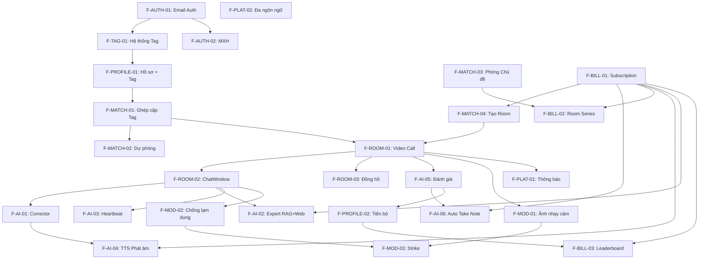

# Đặc tả tính năng

> [!abstract] Cách đọc tài liệu này
> Mỗi tính năng được gắn **Độ ưu tiên** (P0 = MVP bắt buộc, P1 = Giai đoạn 2, P2 = Giai đoạn 3, P3 = Tương lai) và **Giai đoạn**. **Tiêu chí chấp nhận** = điều kiện hoàn thành. **Ghi chú triển khai** = quyết định kỹ thuật quan trọng.

> [!info] Điều hướng nhanh
> [[ERoom/overview|← Tổng quan]] · **Tính năng** · [[ERoom/workflow|Luồng hoạt động →]] · [[ERoom/tasks|Công việc →]] · [[ERoom/notes|Ghi chú kỹ thuật →]] · [[ERoom/decisions|Quyết định kiến trúc →]]

---

## 1. Xác thực & Khởi tạo

### F-AUTH-01 — Đăng ký / Đăng nhập Email `P0` `Giai đoạn 1` ✅ `Đã implement`

Người dùng đăng ký bằng email + mật khẩu. Quản lý phiên JWT với xoay refresh token.

**Tiêu chí chấp nhận:**
- Đăng ký với email, mật khẩu, xác nhận mật khẩu
- Đăng nhập trả về access token (15 phút) + refresh token (7 ngày, httpOnly cookie)
- Đặt lại mật khẩu qua link email
- Rate limit đăng nhập: 5 lần thất bại → khóa 15 phút mỗi IP
- Xác minh email trước lần đăng nhập đầu tiên

**Ghi chú triển khai:**
- `passlib[bcrypt]` rounds=12
- JWT claims: `sub`, `exp`, `iat`, `type` ("access"|"refresh"), `jti`
- Hash refresh token SHA-256 trong `refresh_tokens`, không lưu thô
- Token blacklist Redis với TTL = thời gian hết hạn còn lại

**Phụ thuộc:** [[ERoom/notes#1.2 Bảng users|MySQL]], [[ERoom/notes#2. REDIS|Redis]], SMTP

---

### F-AUTH-02 — Đăng nhập Mạng xã hội `P1` `Giai đoạn 2`

Đăng ký / đăng nhập qua Google và GitHub OAuth.

**Tiêu chí chấp nhận:**
- Đăng nhập Google / GitHub một chạm
- Liên kết nhiều tài khoản mạng xã hội vào một hồ sơ
- Đăng nhập lần đầu → chuyển đến trình khởi tạo (bao gồm bước chọn Tag)

**Ghi chú triển khai:**
- `httpx` để trao đổi OAuth token
- Lưu provider + provider_user_id trong bảng `social_accounts`
- Cùng định dạng JWT bất kể phương thức xác thực

**Phụ thuộc:** Google OAuth app, GitHub OAuth app, [[#F-AUTH-01|F-AUTH-01]]

---

### F-PROFILE-01 — Thiết lập Hồ sơ & Chọn Tag `P0` `Giai đoạn 1` 🔄 `Frontend đang code`

Khi đăng nhập lần đầu, người dùng hoàn thiện hồ sơ: trình độ tiếng Anh (A1-C2), chức danh, mục tiêu học tập, và **đặc biệt — chọn Tag hứng thú**.

**Tiêu chí chấp nhận:**
- Trình khởi tạo 5 bước: Trình độ → Chọn Tag → Chức danh → Mục tiêu → Xác nhận
- **Bước Tag (trọng tâm):** Popup hiện danh sách tag phổ biến theo dạng chip/cloud. Người dùng chọn tối thiểu 1, tối đa 10 tag
- Danh sách tag gợi ý: Openclaw, Claude, Vibe Coding, AI/ML, Marketing, Physics, Math, DevOps, Blockchain, Web3, UX Design, Finance, Healthcare, Education, Gaming, Cybersecurity, Data Science, Product Management, v.v.
- Người dùng có thể tạo tag tùy chỉnh nếu không có sẵn
- Hệ thống gợi ý tag dựa trên chức danh đã chọn
- Tự động phát hiện trình độ qua bài kiểm tra đầu vào tùy chọn (10 câu, 2 phút)
- Hoàn thành hồ sơ kích hoạt tạo vector nhúng để ghép cặp theo tag

**Ghi chú triển khai:**
- Bảng `tags`: id, name, category, usage_count
- Bảng `user_tags`: user_id, tag_id
- Tag search: autocomplete debounce 300ms, gợi ý theo popularity
- Tag tùy chỉnh: lưu vào `tags` với `is_custom=TRUE`, được moderator duyệt định kỳ
- Embedding: kết hợp tag names + career context để tạo vector ghép cặp

**Phụ thuộc:** [[#F-AUTH-01|F-AUTH-01]], [[ERoom/notes#1.3 Bảng tags & user_tags|Bảng tags MySQL]], SentenceTransformer

---

### F-PROFILE-02 — Bảng điều khiển Tiến bộ `P2` `Giai đoạn 3`

Theo dõi thời gian nói, số phiên, điểm AI theo thời gian, phân tích kỹ năng.

**Tiêu chí chấp nhận:**
- Biểu đồ tổng kết hàng tuần
- Biểu đồ radar kỹ năng (ngữ pháp, từ vựng, lưu loát, phát âm)
- Streak tracker với lịch heatmap
- Xuất báo cáo PDF
- **Pro+:** Analytics nâng cao — so sánh với người cùng trình độ, biểu đồ tiến bộ theo tag

**Ghi chú triển khai:**
- Recharts cho tất cả biểu đồ
- Pro+ analytics: truy vấn aggregate sessions của người dùng cùng level + tag
- Cache React Query stale time 5 phút

**Phụ thuộc:** [[#F-AI-03|F-AI-03]], [[ERoom/notes#Bảng sessions|MySQL]]

---

## 2. Hệ thống Tag & Ghép cặp

### F-TAG-01 — Hệ thống Tag `P0` `Giai đoạn 1` ✅ `Đã implement (53 tags, CRUD, search)`

Người dùng chọn tag hứng thú khi đăng ký. Tag là nền tảng cho mọi hoạt động ghép cặp và tạo phòng.

**Tiêu chí chấp nhận:**
- Danh sách 50+ tag phổ biến được curated sẵn
- Người dùng chọn tối thiểu 1, tối đa 10 tag
- Tag tùy chỉnh được hỗ trợ (pending moderator approval)
- Tag cloud hiển thị trên profile người dùng
- Chỉnh sửa tag bất kỳ lúc nào trong Settings

**Ghi chú triển khai:**
- Bảng `tags`: id, name, slug, category, icon, usage_count, is_custom, approved
- Bảng `user_tags`: user_id, tag_id, created_at
- Pre-seed 50+ tags phổ biến trong migration
- Tag gợi ý dựa trên: career context + job title + learning goal
- API: `GET /api/tags/popular`, `GET /api/tags/search?q=`, `POST /api/tags/custom`

**Phụ thuộc:** [[ERoom/notes#1.3 Bảng tags|MySQL (tags, user_tags)]]

---

### F-MATCH-01 — Ghép cặp Tự động theo Tag `P0` `Giai đoạn 1` ✅ `Đã implement (Jaccard + fallback)`

Người dùng nhấn "Bắt đầu nói" → vào hàng đợi → hệ thống tìm 3-5 người có tag tương đồng → tạo phòng → tự động vào.

**Tiêu chí chấp nhận:**
- Ghép cặp trong 30 giây (hoặc đưa ra dự phòng)
- **Ghép cặp theo tag similarity (chính)** + trình độ tiếng Anh (phụ)
- Khi room được tạo, chủ đề room được xác định từ tag chung của người tham gia
- Quy mô: 3-5 người
- Hiển thị vị trí hàng đợi với animation
- Người dùng có thể chọn "Tự động join" nếu có room phù hợp tag đang mở

**Ghi chú triển khai:**
- Redis Sorted Set: `ERoom:queue:tag:{tag_slug}`, score = timestamp
- Công thức tương thích: `score = tag_jaccard * 0.6 + level_proximity * 0.25 + embedding_cosine * 0.15`
- Tag Jaccard similarity: `|tags_A ∩ tags_B| / |tags_A ∪ tags_B|`
- Tự động join: nếu user có auto_join_enabled, quét room đang ACTIVE có tag trùng → tự động thêm vào
- Distributed lock ngăn ghép cặp trùng

**Phụ thuộc:** [[ERoom/notes#Redis|Redis queue]], [[ERoom/decisions#ADR-001|LiveKit]], [[ERoom/notes#Bảng users + user_tags|MySQL]]

---

### F-MATCH-02 — Phòng Dự phòng `P0` `Giai đoạn 1`

Nếu không tìm thấy người ghép trong 30s, mở rộng tiêu chí dần dần.

**Tiêu chí chấp nhận:**
- 30s: đề xuất ghép cặp chéo tag (bỏ qua tag, cùng trình độ)
- 45s: mở rộng sang trình độ lân cận (±1 bậc)
- 60s: đề xuất phòng AI (1-2 người + AI avatar)
- Tất cả dự phòng là opt-in

**Phụ thuộc:** [[#F-MATCH-01|F-MATCH-01]]

---

### F-MATCH-03 — Phòng theo Chủ đề Tag `P1` `Giai đoạn 2`

Phòng được lên lịch trước xoay quanh tag/chủ đề cụ thể.

**Tiêu chí chấp nhận:**
- Duyệt phòng chủ đề sắp tới, lọc theo tag
- Đăng ký quan tâm → thông báo khi phòng đủ người
- Pro+ có thể tạo "Room Series" (chuỗi phòng theo chủ đề, ví dụ "Tiếng Anh DevOps Buổi 1/5")
- AI host cho phòng không có người điều phối

**Ghi chú triển khai:**
- Bảng `room_series`: id, creator_id, title, tag_id, session_count, schedule
- Mỗi series tạo nhiều `topic_rooms` với lịch định kỳ
- Thông báo 15 phút và 5 phút trước giờ bắt đầu

**Phụ thuộc:** [[#F-MATCH-01|F-MATCH-01]], [[#F-PLAT-01|F-PLAT-01]], [[#F-BILL-02|F-BILL-02 (Pro+)]]

---

### F-MATCH-04 — Tạo Room Thủ công `P1` `Giai đoạn 2`

**Pro/Pro+ được tạo room** với tag mong muốn. Free không có quyền này.

**Tiêu chí chấp nhận:**
- Pro/Pro+ vào "Tạo Room" → chọn 1-3 tag → đặt chủ đề → mời người hoặc mở public
- Room có thể là public (ai cũng join được) hoặc private (chỉ người được mời)
- Pro có thể mời guest (Free user) vào room riêng
- Admin luôn được tạo room

**Ghi chú triển khai:**
- Middleware kiểm tra subscription tier khi gọi `POST /api/rooms`
- Bảng `rooms` thêm cột: `tags` (TEXT[]), `is_public` (BOOLEAN)
- Guest invite: tạo link tạm thời (hết hạn 1h) cho Free user

**Phụ thuộc:** [[#F-BILL-01|F-BILL-01 (Subscription)]], [[#F-AUTH-01|F-AUTH-01]]

---

## 3. Trò chuyện Thời gian thực

### F-ROOM-01 — Cuộc gọi Video `P0` `Giai đoạn 1` ✅ `LiveKit + token API`

Cuộc gọi video nhóm 3-5 người qua LiveKit WebRTC.

**Tiêu chí chấp nhận:**
- Bố cục lưới video responsive
- Làm nổi bật người đang nói (viền xanh)
- Tắt/bật mic + video với chỉ báo trực quan
- Chỉ báo chất lượng mạng (xanh/vàng/đỏ)
- Tự động kết nối lại với exponential backoff

**Ghi chú triển khai:**
- `@livekit/components-react` cho component dựng sẵn
- Ràng buộc video: tối đa 720p, 30fps, adaptive bitrate
- Tất cả component LiveKit phải client-side only (`'use client'`)

**Phụ thuộc:** [[ERoom/decisions#ADR-001|LiveKit]], coTURN

---

### F-ROOM-02 — ChatWindow Tích hợp `P0` `Giai đoạn 1` 🔄 `Frontend đang code`

ChatWindow trong phòng hiển thị: tin nhắn văn bản, transcript trực tiếp, sửa lỗi AI, câu trả lời expert, heartbeat, và nút TTS.

**Tiêu chí chấp nhận:**
- **Transcript trực tiếp:** Khi người dùng nói → text hiển thị NGAY LẬP TỨC trên ChatWindow (màu xám = tạm thời, trắng = cuối cùng)
- **Sửa lỗi AI:** Hiển thị dưới dạng card với: text gốc (gạch ngang) → text sửa (xanh) + giải thích + **nút TTS "Nghe phát âm chuẩn"**
- **Expert Q&A:** Câu hỏi người dùng → câu trả lời của agent trong ChatWindow với badge "Expert"
- **Heartbeat:** Tin nhắn hệ thống với avatar robot khi AI khởi động hội thoại
- Phản ứng emoji nhanh trên tin nhắn
- Chat tồn tại sau phiên (xem trong Session History)

**Ghi chú triển khai:**
- Tin nhắn lưu trong bảng `messages` với `message_type`: text, transcript, ai_correction, ai_expert, ai_heartbeat, system
- WebSocket events: `transcript_update`, `ai_correction`, `ai_expert_response`, `ai_heartbeat`, `tts_audio_ready`
- TTS button: gọi `POST /api/tts/generate` → nhận audio URL → phát bằng howler.js

**Phụ thuộc:** [[ERoom/notes#WebSocket|WebSocket]], [[#F-AI-01|F-AI-01 (Corrector)]], [[#F-AI-02|F-AI-02 (Expert)]], [[#F-AI-03|F-AI-03 (Heartbeat)]], [[#F-AI-04|F-AI-04 (TTS)]]

---

### F-ROOM-03 — Đồng hồ & Hiển thị Chủ đề `P0` `Giai đoạn 1`

Phòng hiển thị chủ đề (dựa trên tag chung), thời gian, và tag của người tham gia.

**Tiêu chí chấp nhận:**
- Tiêu đề chủ đề ở đầu phòng (tự động sinh từ tag chung)
- Tag badge của từng người tham gia hiển thị trên video tile
- Đồng hồ đếm ngược (mặc định 15 phút)
- Cảnh báo 2 phút (vàng) và 30 giây (đỏ)
- Tự động chuyển REVIEW khi hết giờ

**Phụ thuộc:** [[ERoom/notes#Redis|Redis room state]], [[#F-ROOM-01|F-ROOM-01]]

---

## 4. Hệ thống AI Agent 3-trong-1

> [!important] Kiến trúc AI Agent
> AI Agent trong mỗi phòng là **1 agent duy nhất** đảm nhận đồng thời 3 vai trò. Hệ thống subscription quyết định mức độ agent: Free → cơ bản; Pro → nâng cao; Pro+ → đầy đủ.

### F-AI-01 — Corrector: Sửa lỗi Chính tả & Ngữ pháp `P0` `Giai đoạn 1` ✅ `PronunciationPipeline + LLM`

AI nghe từng câu người dùng nói → phát hiện lỗi → trả về bản sửa trong ChatWindow.

**Tiêu chí chấp nhận:**
- Transcript hiển thị NGAY LẬP TỨC trên ChatWindow khi người dùng nói
- Sau khi người dùng ngừng nói 2s → AI phân tích → trả về sửa lỗi (text gốc + text sửa + giải thích)
- KHÔNG làm gián đoạn người đang nói
- Hiển thị dưới dạng card trong ChatWindow (không phải toast)
- **Free:** tối đa 3 lần sửa lỗi / phòng
- **Pro trở lên:** sửa lỗi không giới hạn, chi tiết hơn (phân tích ngữ pháp, gợi ý từ vựng thay thế)

**Ghi chú triển khai:**
- Pipeline: Âm thanh → WebSocket → Whisper STT → Celery → LLM → WebSocket → ChatWindow
- Prompt LLM: system = huấn luyện viên tiếng Anh nhận biết trình độ + tag context
- JSON output: `{has_errors, corrections: [{original, corrected, explanation, type, severity}], overall_score}`
- Free quota: Redis counter `ERoom:correction:{room_id}:{user_id}` reset mỗi phiên

**Phụ thuộc:** Whisper API, LLM (GPT-4o), [[ERoom/notes#WebSocket|WebSocket]], [[#F-BILL-01|Subscription]]

---

### F-AI-02 — Expert: RAG + Web Search Q&A `P1` `Giai đoạn 2`

Agent là chuyên gia trong lĩnh vực tag của room. Nạp kiến thức từ Minio (RAG) và Web Search để trả lời câu hỏi chuyên môn.

**Tiêu chí chấp nhận:**
- **Khi khởi tạo phòng:** Agent tự động nạp knowledge từ Minio (tài liệu theo tag) + index Web Search context
- Người dùng gõ câu hỏi trong ChatWindow → Agent trả lời dựa trên RAG + Web Search
- Câu trả lời có badge "Expert" + nguồn tham khảo (link web nếu có)
- **Free:** KHÔNG có Expert
- **Pro:** Expert với Web Search only (không RAG)
- **Pro+:** Expert với RAG (Minio) + Web Search đầy đủ

**Ghi chú triển khai:**
- Minio bucket `ERoom-rag-docs` lưu tài liệu theo tag (PDF, markdown, txt)
- Khi tạo phòng: Celery task `load_rag_knowledge(tags)` → embed documents → lưu vào vector store tạm
- Web Search: Brave Search API, cache kết quả 1h trong Redis
- RAG pipeline: query → embed → vector search (TiDBRawVectorStore / NumpyVectorStore) → rerank → LLM answer
- Agent avatar được lưu trong Minio `ERoom-avatars/{tag}.png`

**Phụ thuộc:** [[ERoom/decisions#ADR-012|Minio]], [[ERoom/decisions#ADR-014|Web Search API]], TiDBRawVectorStore / NumpyVectorStore, LLM, [[#F-BILL-01|Subscription]]

---

### F-AI-03 — Heartbeat: Khởi động Hội thoại `P1` `Giai đoạn 2`

Khi phòng im lặng > 10s, agent đưa ra câu hỏi khởi động.

**Tiêu chí chấp nhận:**
- Kích hoạt sau 10s im lặng (tất cả người tham gia < ngưỡng âm thanh)
- Câu hỏi liên quan đến tag phòng + ngữ cảnh transcript gần đây
- **Free:** tối đa 1 heartbeat / phòng
- **Pro:** tối đa 3 heartbeat / phòng
- **Pro+:** tối đa 5 heartbeat / phòng
- Tối thiểu 2 phút giữa các heartbeat
- Nếu không phản hồi sau 20s → tắt heartbeat cho phiên đó

**Ghi chú triển khai:**
- Phát hiện im lặng qua WebRTC audioLevel, ngưỡng RMS hiệu chỉnh theo từng user
- Prompt LLM: system = facilitator, context = 10 dòng transcript cuối + tag phòng + tên người tham gia
- Redis counter: `ERoom:heartbeat:{room_id}` (int, TTL phiên)

**Phụ thuộc:** LiveKit audio level, LLM (GPT-4o-mini), [[#F-BILL-01|Subscription]]

---

### F-AI-04 — TTS: Text-to-Speech Phát âm Chuẩn `P2` `Giai đoạn 3`

Khi AI sửa lỗi, người dùng có thể bấm nút để nghe phát âm chuẩn của từ/câu đã sửa.

**Tiêu chí chấp nhận:**
- Nút "🔊 Nghe phát âm chuẩn" xuất hiện trên mỗi card sửa lỗi AI (chỉ Pro+)
- Bấm nút → audio phát ngay trong ChatWindow (không cần tải file)
- Hỗ trợ phát âm từng từ hoặc cả câu
- TTS engine: OpenAI tts-1 hoặc ElevenLabs Multilingual v2

**Ghi chú triển khai:**
- API: `POST /api/tts/generate {text, language, speed}` → `{audio_url, duration}`
- Audio lưu tạm trong Minio (TTL 24h) hoặc Redis (base64, TTL 1h)
- Frontend: howler.js để streaming audio playback
- Cache TTS: Redis key `ERoom:tts:{sha256(text+language)}` TTL 24h
- **Chỉ Pro+ mới có quyền gọi TTS**

**Phụ thuộc:** OpenAI TTS / ElevenLabs API, Minio, [[#F-BILL-01|Subscription]]

---

### F-AI-05 — Đánh giá Sau phiên `P0` `Giai đoạn 1` ✅ `PronunciationScorer + SessionService`

Sau khi phiên kết thúc, tạo đánh giá cá nhân.

**Tiêu chí chấp nhận:**
- Đánh giá gửi trong 30s sau phiên
- Hiển thị: top 5 lỗi, thời gian nói, số từ, điểm tổng thể (0-10)
- Phân tích: ngữ pháp, từ vựng, lưu loát, phát âm
- "Thực hành các câu này" với bản đã sửa
- Chia sẻ dưới dạng ảnh hoặc link

**Ghi chú triển khai:**
- Celery task kích hoạt khi phòng END
- Prompt LLM: transcript đầy đủ + corrections + metadata
- Dự phòng: đánh giá chỉ số liệu nếu LLM thất bại

**Phụ thuộc:** LLM (GPT-4o), [[ERoom/decisions#ADR-008|Celery]], [[ERoom/notes#Bảng sessions|MySQL]]

---

### F-AI-06 — Tự động Take Note (Pro+) `P2` `Giai đoạn 3`

**Pro+:** AI tự động ghi chú (note) tóm tắt nội dung phiên, lưu vào profile người dùng.

**Tiêu chí chấp nhận:**
- Sau phiên, AI tạo bản note markdown tóm tắt
- Note bao gồm: từ vựng mới đã học, lỗi đã sửa, chủ đề thảo luận, điểm cần cải thiện, câu hỏi hay
- Note hiển thị trong tab "Ghi chú" trên profile
- Có thể export note ra PDF/Markdown
- Note có thể tìm kiếm theo tag, ngày, từ khóa

**Ghi chú triển khai:**
- Bảng `session_notes`: id, user_id, session_id, content (markdown), tags, created_at
- Prompt LLM: tóm tắt từ transcript + corrections theo format có cấu trúc
- Note viewer: render markdown với syntax highlighting
- **Chỉ Pro+ mới kích hoạt tính năng này**

**Phụ thuộc:** [[#F-AI-05|F-AI-05 (Đánh giá)]], LLM, [[ERoom/notes#Bảng session_notes|MySQL]], [[#F-BILL-01|Subscription]]

---

## 5. Bảo mật & Kiểm duyệt

### F-MOD-01 — Phát hiện Ảnh nhạy cảm `P1` `Giai đoạn 2`

AI quét video frame trong phòng để phát hiện nội dung nhạy cảm/không phù hợp.

**Tiêu chí chấp nhận:**
- Quét video frame định kỳ (mỗi 30s) của tất cả người tham gia
- Nếu phát hiện ảnh nhạy cảm (NSFW confidence > 0.85):
  - **Cảnh báo lần 1:** Tắt video của người dùng, hiển thị cảnh báo
  - **Cảnh báo lần 2:** Tắt video + ghi nhận strike
  - **Lần 3:** Tự động ban 24h + thông báo cho admin
- Thông báo cho tất cả người tham gia: "{tên} đã bị tắt video vì nội dung không phù hợp"

**Ghi chú triển khai:**
- Celery task `scan_video_frame(frame_base64, room_id, user_id)` gọi NSFW detector
- NSFW Detector: tự host `nsfw_detector` (TensorFlow) hoặc Google Vision SafeSearch API
- Frame được chụp từ LiveKit track (client gửi qua WebSocket hoặc server-side grab)
- Bảng `moderation_events`: id, user_id, room_id, event_type (video_nsfw), evidence_url, action

**Phụ thuộc:** NSFW Detector, LiveKit, [[ERoom/notes#WebSocket|WebSocket]], [[#F-MOD-03|F-MOD-03 (Strike)]]

---

### F-MOD-02 — Chống Lạm dụng Agent `P1` `Giai đoạn 2`

Ngăn chặn người dùng lợi dụng AI Agent vào mục đích cá nhân không liên quan đến luyện tập tiếng Anh.

**Tiêu chí chấp nhận:**
- Agent từ chối các yêu cầu: viết code, debug, viết nội dung không liên quan, câu hỏi cá nhân quá đà
- Khi bị từ chối, agent trả lời lịch sự: "Xin lỗi, tôi là trợ lý luyện tập tiếng Anh. Tôi không thể giúp bạn việc này. Bạn muốn thảo luận về chủ đề '{tag}' không?"
- Phát hiện misuse pattern: nếu 1 user bị từ chối 3 lần trong 1 phiên → gắn cờ cho moderator
- Prompt guardrail + classifier phát hiện intent không liên quan

**Ghi chú triển khai:**
- **Prompt guardrail** trong system prompt agent: "You are an English practice assistant ONLY. Politely decline any requests for coding, debugging, writing non-English content, personal tasks, or any use not related to English conversation practice."
- **Intent classifier:** Celery task dùng GPT-4o-mini phân loại intent trước khi xử lý. Nếu `intent != 'english_practice'` → từ chối
- Bảng `agent_misuse_logs`: user_id, room_id, query, intent, action (declined), timestamp

**Phụ thuộc:** LLM, [[#F-MOD-03|F-MOD-03]]

---

### F-MOD-03 — Hệ thống Báo cáo & Strike `P1` `Giai đoạn 2`

Hệ thống điểm phạt cho hành vi không phù hợp.

**Tiêu chí chấp nhận:**
- Nút "Báo cáo" trong phòng (biểu tượng cờ)
- Hệ thống strike: 3 strike → ban 24h, 5 strike → ban vĩnh viễn
- Tự động gắn cờ nội dung độc hại qua LLM classifier trên transcript
- Hàng đợi xem xét thủ công cho báo cáo kháng cáo
- AI moderation gắn cờ transcript + video frame

**Ghi chú triển khai:**
- Prompt moderation LLM: "Văn bản này có chứa quấy rối, ngôn từ thù địch, nội dung tục tĩu, hoặc spam không? CÓ/KHÔNG."
- Bảng `strikes`: id, user_id, reason, evidence, created_at, expires_at
- Auto-ban trigger trong middleware `get_current_active_user`

**Phụ thuộc:** [[ERoom/notes#Bảng moderation|MySQL]], LLM

---

## 6. Hệ thống Subscription

### F-BILL-01 — Hệ thống Bậc Subscription `P2` `Giai đoạn 3`

Ba bậc gói với tích hợp Stripe.

| Tính năng | Free | Pro ($9.99/tháng) | Pro+ ($19.99/tháng) |
|-----------|------|-------------------|---------------------|
| Số phòng / ngày | 2 | Không giới hạn | Không giới hạn |
| Tạo room | ❌ | ✅ | ✅ |
| Sửa lỗi AI | 3/phòng | Không giới hạn | Không giới hạn |
| Heartbeat | 1/phòng | 3/phòng | 5/phòng |
| Expert Q&A | ❌ | Web Search only | RAG + Web Search |
| TTS Phát âm | ❌ | ❌ | ✅ |
| Auto Take Note | ❌ | ❌ | ✅ |
| Room Series | ❌ | ❌ | ✅ |
| Analytics nâng cao | ❌ | ❌ | ✅ |
| Leaderboard | ❌ | ❌ | ✅ |
| Mời guest | ❌ | ✅ | ✅ |
| Dùng thử | — | 7 ngày | 7 ngày |

**Cơ chế quota agent trong room:**
- Room toàn Free → Agent cơ bản (sửa lỗi giới hạn, heartbeat giới hạn, không Expert)
- Room có ≥1 Pro → Agent nâng cao (sửa lỗi đầy đủ, heartbeat đầy đủ, Expert Web Search)
- Room có ≥1 Pro+ → Agent đầy đủ (thêm TTS, auto take note cho riêng Pro+, RAG đầy đủ)

**Ghi chú triển khai:**
- Stripe Checkout để tạo gói
- Webhook handler xử lý: checkout.session.completed, subscription.updated, subscription.deleted
- Middleware kiểm tra tier khi tạo phòng và truy cập tính năng AI
- Room agent level được xác định khi tạo phòng: quét tier của tất cả participants → chọn level cao nhất

**Phụ thuộc:** Stripe API, [[#F-AUTH-01|F-AUTH-01]]

---

### F-BILL-02 — Room Series (Pro+) `P2` `Giai đoạn 3`

Pro+ có thể tạo chuỗi phòng theo chủ đề.

**Tiêu chí chấp nhận:**
- Tạo series: chọn tag, tiêu đề, số buổi, lịch (hàng tuần / 2 lần/tuần)
- Mỗi buổi trong series là 1 topic room riêng
- Người dùng khác có thể đăng ký toàn bộ series
- Pro+ được analytics riêng cho series (tiến bộ qua các buổi)

**Phụ thuộc:** [[#F-MATCH-03|F-MATCH-03]], [[#F-BILL-01|F-BILL-01]]

---

### F-BILL-03 — Leaderboard `P2` `Giai đoạn 3`

Bảng xếp hạng hàng tuần cho người dùng Pro+.

**Tiêu chí chấp nhận:**
- Xếp hạng theo: thời gian nói, điểm AI, streak, số phiên
- Phân theo tag (ví dụ: "Top người luyện AI/ML tuần này")
- Reset hàng tuần
- Huy hiệu thành tích (badge) hiển thị trên profile

**Ghi chú triển khai:**
- Bảng `leaderboard`: id, user_id, tag_id, week_start, speaking_time, avg_score, sessions_count, rank
- Celery Beat tính toán mỗi Chủ Nhật 23:59
- Cache Redis TTL 1h

**Phụ thuộc:** [[ERoom/notes#Bảng sessions|MySQL]], [[#F-BILL-01|F-BILL-01]]

---

## 7. Nền tảng & Xuyên suốt

### F-PLAT-01 — Hệ thống Thông báo `P1` `Giai đoạn 2`

Thông báo đẩy cho các sự kiện quan trọng.

**Tiêu chí chấp nhận:**
- Push notification (Service Worker)
- Email digest (hàng ngày/tuần)
- Chuông trong ứng dụng với số chưa đọc
- Các sự kiện thông báo: match_found, session_starting, review_ready, series_starting, leaderboard_update, subscription_expiring

**Phụ thuộc:** Web Push API, SMTP, [[#F-AUTH-01|F-AUTH-01]]

---

### F-PLAT-02 — UI Đa ngôn ngữ `P2` `Giai đoạn 3`

UI hỗ trợ tiếng Anh + tiếng Việt.

**Tiêu chí chấp nhận:**
- Chuyển đổi ngôn ngữ trong navbar và settings
- Tất cả chuỗi UI được ngoại hóa (i18n JSON)
- Định dạng ngày/số nhận biết locale

**Ghi chú triển khai:**
- `i18next` với react-i18next
- `src/i18n/en.json`, `src/i18n/vi.json`

**Phụ thuộc:** i18next

---

## Đồ thị Phụ thuộc Tính năng

---

## Số lượng Tính năng theo Giai đoạn

| Giai đoạn | Tính năng | P0 | P1 | P2 | P3 |
|-------|----------|----|----|----|----|
| Giai đoạn 1 (MVP) | F-AUTH-01, F-TAG-01, F-PROFILE-01, F-MATCH-01, F-MATCH-02, F-ROOM-01, F-ROOM-02, F-ROOM-03, F-AI-01, F-AI-05 | 10 | 0 | 0 | 0 |
| Giai đoạn 2 (AI Agent) | F-AUTH-02, F-MATCH-03, F-MATCH-04, F-AI-02, F-AI-03, F-MOD-01, F-MOD-02, F-MOD-03, F-PLAT-01 | 0 | 9 | 0 | 0 |
| Giai đoạn 3 (Mở rộng) | F-PROFILE-02, F-AI-04, F-AI-06, F-BILL-01, F-BILL-02, F-BILL-03, F-PLAT-02 | 0 | 0 | 7 | 0 |
| **Tổng** | **26** | **10** | **9** | **7** | **0** |

---

## Liên quan

- [[ERoom/tasks|Công việc]] — Kế hoạch triển khai
- [[ERoom/workflow|Luồng hoạt động]] — Sơ đồ luồng người dùng & hệ thống
- [[ERoom/notes|Ghi chú kỹ thuật]] — SQL DDL, API contracts, Redis keys, RAG architecture
- [[ERoom/decisions|Quyết định kiến trúc]] — 16+ ADR
- [[ERoom/overview|Tổng quan]] — Tóm tắt & kiến trúc

