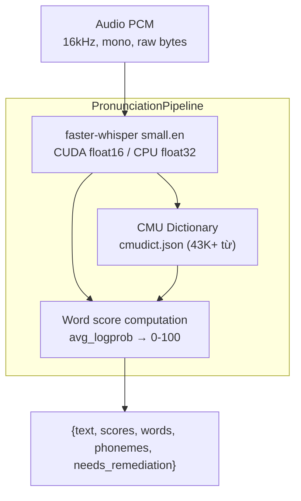
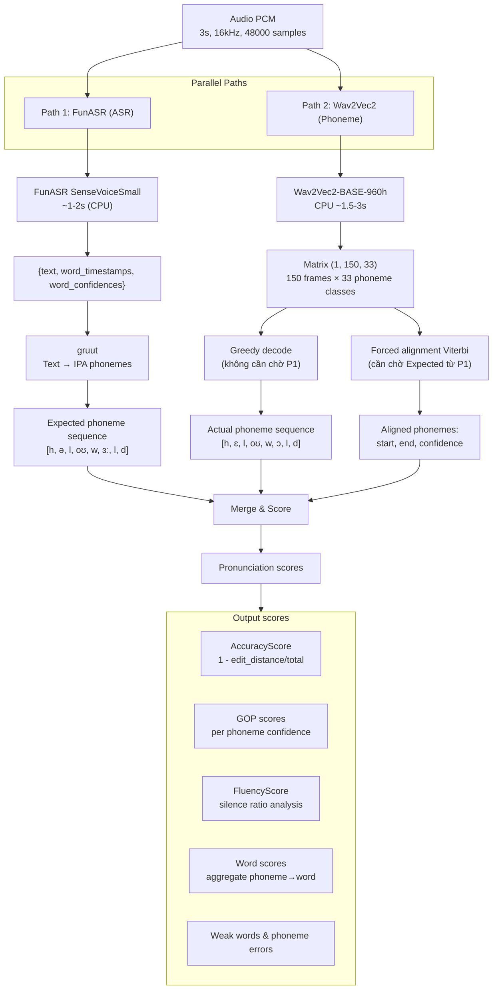
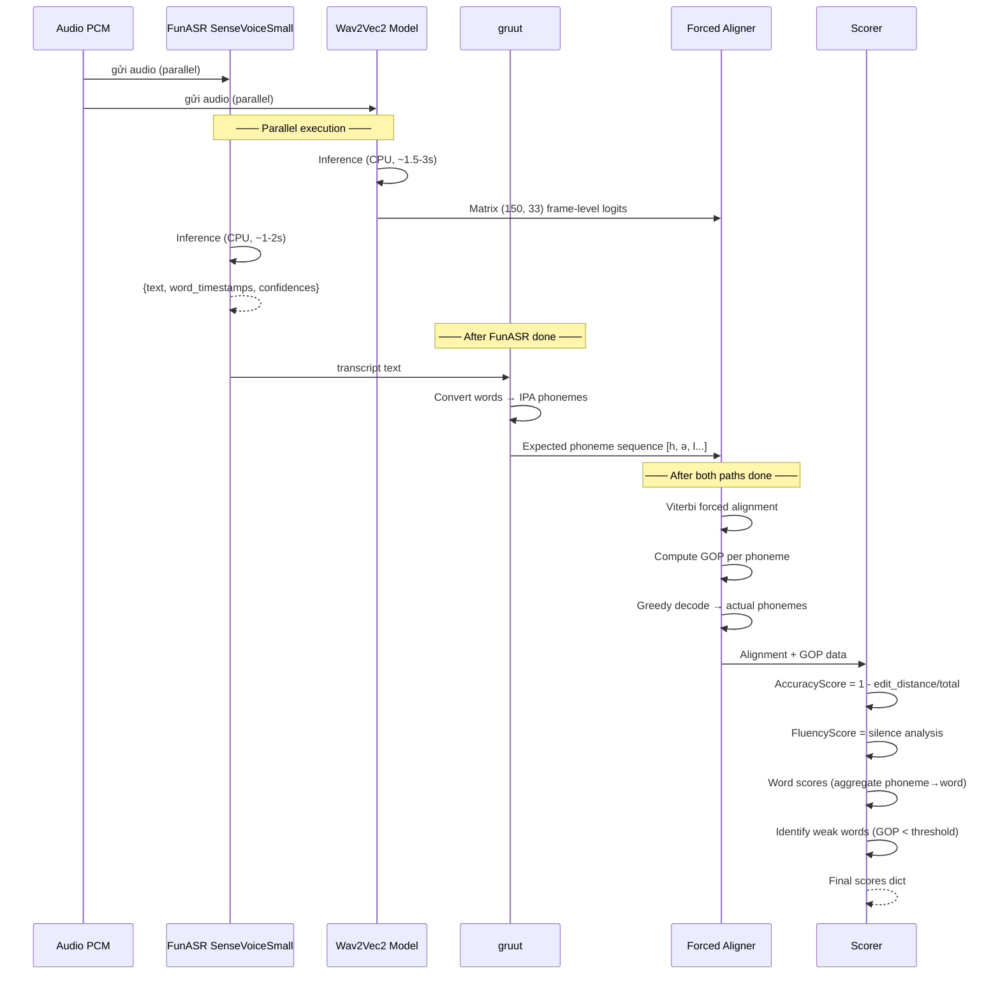

# Pronunciation Scoring Workflow

> [!danger] Tài liệu tham khảo thiết kế — KHÔNG phải kiến trúc hiện tại
> Tài liệu này mô tả kiến trúc **mục tiêu** (FunASR + Wav2Vec2 + GOP) dùng trong giai đoạn thiết kế.
>
> **Code thực tế** hiện dùng pipeline đơn giản hơn:
> - **STT**: `faster-whisper small.en` (CUDA float16)
> - **Phoneme lookup**: CMU Dictionary tĩnh (`cmudict.json`)
> - **Scoring**: Whisper `avg_logprob` → confidence scale 0-100
> - **Không có**: Wav2Vec2, forced alignment Viterbi, GOP scoring
>
> File code thực tế: `backend/app/infrastructure/audio_pipeline.py`

## Kiến trúc hiện tại



### Chi tiết scoring

| Bước | Mô tả | Input | Output |
|------|-------|-------|--------|
| 1 | Whisper transcribe | PCM bytes (float32 array) | segments: text + avg_logprob |
| 2 | Scale confidence | avg_logprob (range ~ -4 to 0) | `min(max((logprob+2)/4, 0.1), 1.0)` |
| 3 | CMU lookup | word → dictionary | ARPAbet phoneme sequence |
| 4 | Word score | confidence × 100 | score per word (capped 100) |
| 5 | Aggregate | mean of word scores | overall score 0-100 |
| 6 | Remediation flag | overall < 70 | needs_remediation = True |

> [!note] Scoring dựa trên confidence của Whisper, **không** phải GOP (Goodness of Pronunciation). GOP yêu cầu Wav2Vec2 alignment với Viterbi decoding để có frame-level logits — chưa implement.

## Kiến trúc thiết kế (mục tiêu)

> [!warning] Phần dưới đây là **thiết kế mục tiêu** — chưa implement.
> Tham khảo khi nâng cấp pronunciation pipeline trong tương lai.



## Flow từng bước



## Wav2Vec2 chi tiết

### Input → Output shape

| Stage | Operation | Input shape | Output shape | Note |
|-------|-----------|-------------|--------------|------|
| 1 | CNN encoder (7 conv, stride=320) | (1, 48000) | (1, 150, 768) | 150 frames, stride 20ms |
| 2 | Transformer (12 layers) | (1, 150, 768) | (1, 150, 768) | Context-aware features |
| 3 | Linear head | (1, 150, 768) | (1, 150, 33) | 32 phoneme + 1 blank |
| 4 | Softmax | logits → probs | (1, 150, 33) | Frame-level probabilities |

**Mỗi frame:** cách nhau **20ms** (320 samples / 16000 Hz).  
**3 giây audio** → ~150 frames.

### Matrix output (150 frames × 33 classes) — ví dụ

```
Frame 0:  [0.01, 0.02, 0.85, 0.00, ..., 0.01]   ← /h/ = 0.85
Frame 1:  [0.01, 0.01, 0.90, 0.01, ..., 0.02]   ← /h/ = 0.90
Frame 2:  [0.01, 0.00, 0.88, 0.01, ..., 0.03]   ← /h/ = 0.88
Frame 3:  [0.90, 0.02, 0.01, 0.00, ..., 0.01]   ← /ə/ = 0.90 (user nói /ɛ/)
...
Frame 149:[0.01, 0.01, 0.02, 0.01, ..., 0.85]   ← blank = 0.85
```

## CTC Alignment

### Greedy decode (không cần transcript)

```
Mỗi frame: argmax → phoneme_id
Collapse: merge repeats → remove blank

Raw:  h h h _ _ _ _ ɛ ɛ ɛ _ _ _ l l oʊ oʊ _ _
      └──────┬─────┘ └──┬──┘     └┬┘ └──┬───┘
Collapse:    h          ɛ         l    oʊ

Actual sequence: [h, ɛ, l, oʊ]
```

### Forced alignment Viterbi (cần expected phonemes)

Bài toán: tìm path tối ưu trong matrix (150, 33) thỏa mãn expected sequence `[h, ə, l, oʊ]`.

```
                  Frame: 1  2  3  4  5  6  7  8  9  10 11 12 ...
Expected /h/:     ┌─────────────────────┐
                  │  h  h  h  _  _  _   │
                  └─────────────────────┘
Expected /ə/:                    ┌──────────────┐
                                 │  _  ɛ  ɛ  ə   │  ← model cho /ɛ/ cao hơn
                                 └──────────────┘
Expected /l/:                            ┌───────┐
                                          │  l  l  │
                                          └───────┘
Expected /oʊ/:                                  ┌──────────┐
                                                │  oʊ oʊ   │
                                                └──────────┘

Output:
    /h/   → frames 0-2   (confidence: 0.92) ✅
    /ə/   → frames 6-8   (confidence: 0.47) ❌ (vì /ɛ/ = 0.55)
    /l/   → frames 9-11  (confidence: 0.88) ✅
    /oʊ/  → frames 12-15 (confidence: 0.95) ✅
```

## GOP (Goodness of Pronunciation)

Với mỗi phoneme `p` ở frames `[start, end]`:

```
GOP(p) = log [ P(p | audio) / max_{q ≠ p} P(q | audio) ]
```

Áp dụng cho /ə/:

```
Frame 6: /ə/ = 0.40, /ɛ/ = 0.55
Frame 7: /ə/ = 0.45, /ɛ/ = 0.50
Frame 8: /ə/ = 0.50, /ɛ/ = 0.45

P(/ə/ | audio) = 0.45
max P(q | audio) = P(/ɛ/) = 0.50

GOP(/ə/) = log(0.45 / 0.50) = -0.046
```

**Threshold:** GOP < -0.1 → phát âm yếu, cần cải thiện.

## Scoring công thức

### AccuracyScore
```
edit_distance = số phoneme khác nhau giữa expected và actual
AccuracyScore = max(0, 1 - edit_distance / total_phonemes) × 100
```

### FluencyScore
```
silence_ratio = tổng thời gian blank giữa các phoneme / tổng duration
FluencyScore = max(0, 100 - abs(silence_ratio - 0.10) × 300)
```
Native English: ~10% silence.

### Word scores
```python
Ví dụ: "hello" có 4 phonemes [h, ə, l, oʊ]
word_score = (GOP_h + GOP_ə + GOP_l + GOP_oʊ) / 4 * 50 + 50
```

### PronScore (tổng hợp)
```
PronScore = Accuracy × 0.40 + Fluency × 0.25 + GOP × 0.20 + Prosody × 0.15
```

## Output cuối cùng

```json
{
  "transcript": "hello world",
  "pronunciation": {
    "pron_score": 78,
    "accuracy_score": 75,
    "fluency_score": 82,
    "gop_score": 80,
    "prosody_score": 74,
    "word_scores": [
      {
        "word": "hello",
        "score": 82,
        "phoneme_errors": [
          {"expected": "ə", "actual": "ɛ", "gop": -0.05, "frames": "6-8"}
        ]
      },
      {
        "word": "world",
        "score": 73,
        "phoneme_errors": [
          {"expected": "ɜː", "actual": "ɔ", "gop": -0.12, "frames": "19-22"}
        ]
      }
    ],
    "weak_words": ["world"],
    "feedback": "Từ 'world': bạn đọc /wɔrld/ thay vì /wɜːld/. Mở tròn môi hơn, lưỡi kéo về sau."
  }
}
```

## Graceful degradation

| Tình huống | Kết quả |
|------------|---------|
| FunASR fail | Vẫn chạy Wav2Vec2, chỉ lấy actual phoneme |
| Wav2Vec2 fail | Chỉ lấy FunASR word confidence |
| Cả 2 fail | Corrector LLM vẫn chạy bình thường |
| Pronunciation scores = null | Bỏ qua phần pron, chỉ hiển thị grammar correction |

---

## Liên quan

- [[ERoom/overview|Tổng quan]] — Kiến trúc hệ thống
- [[ERoom/features|Tính năng]] — F-AI-01 Corrector
- [[ERoom/notes|Ghi chú kỹ thuật]] — API contracts
- [[ERoom/dev-notes|Dev Notes]] — Testing & known issues
