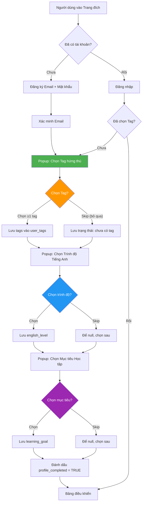
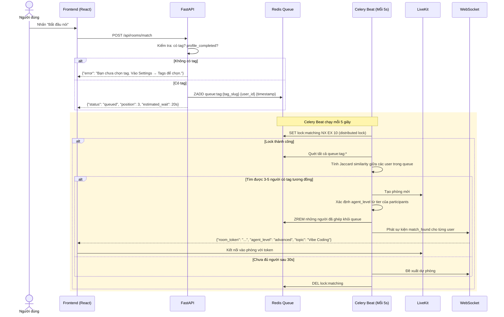
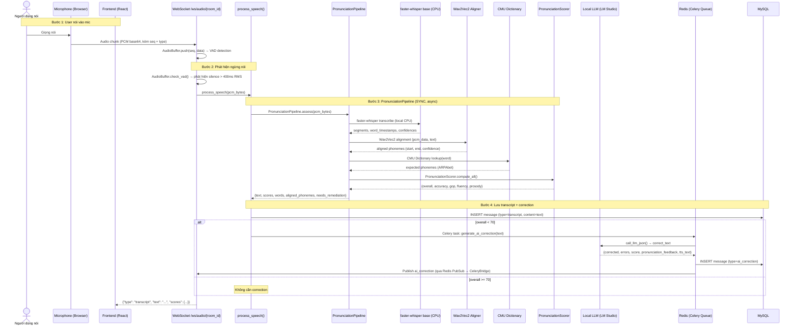
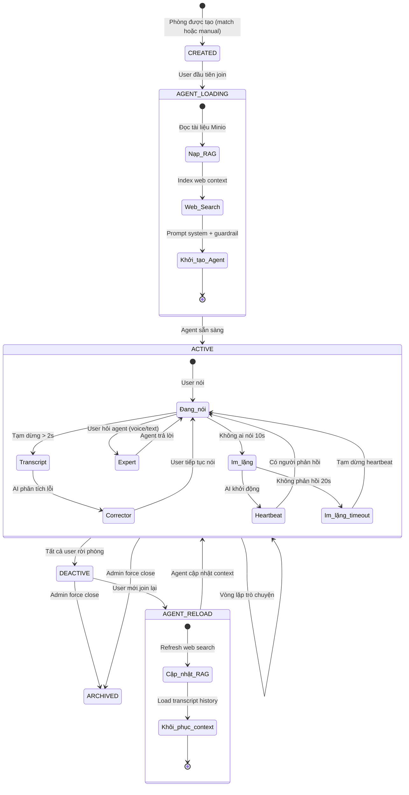
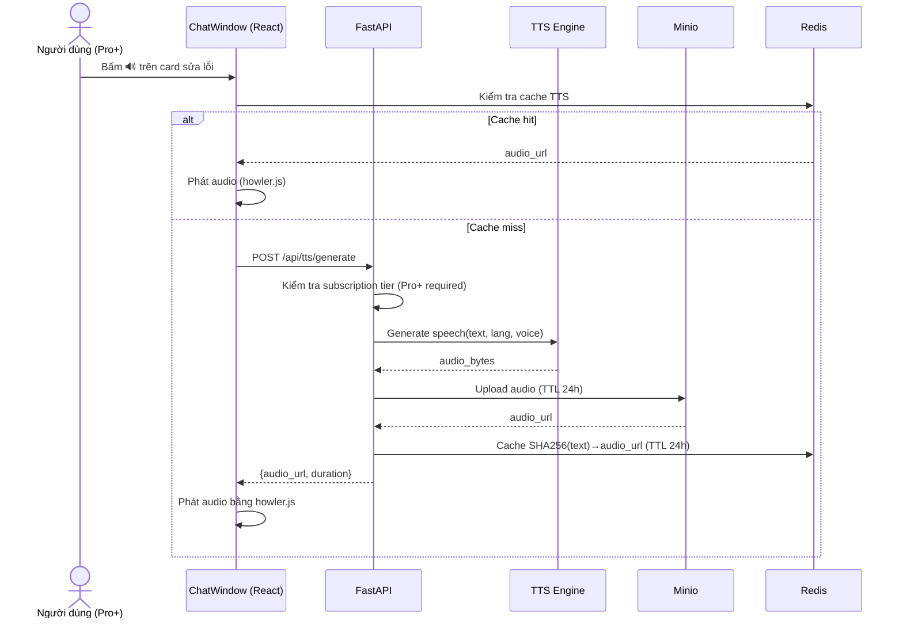
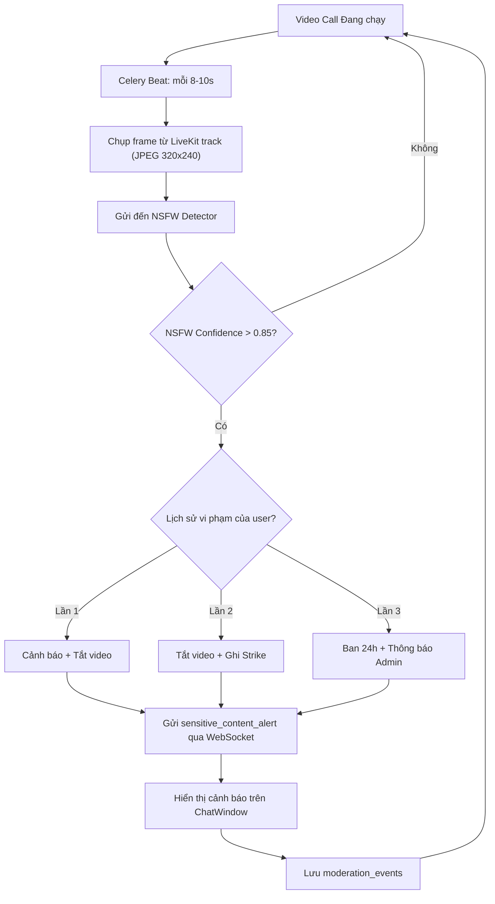
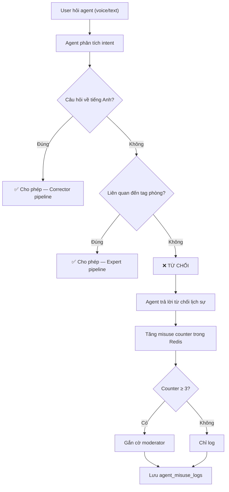
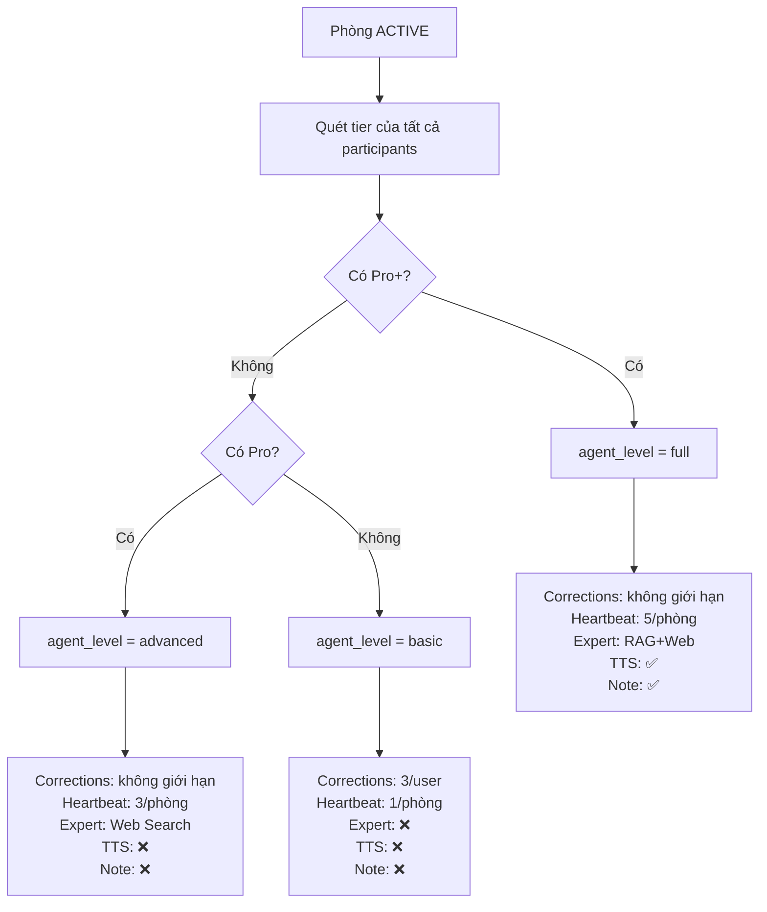
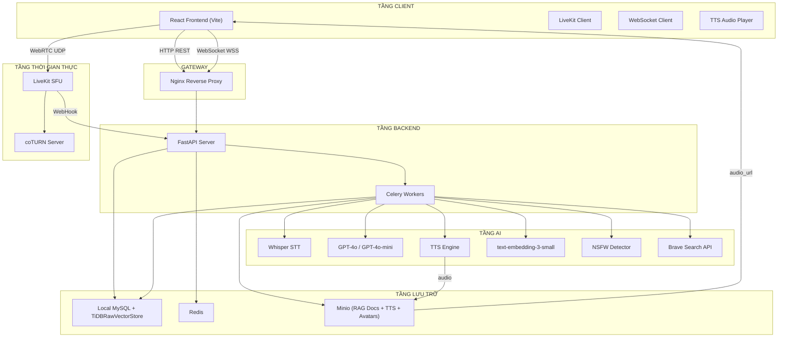

# Luồng hoạt động

> [!abstract] Hành trình người dùng & luồng hệ thống
> Luồng end-to-end với kiến trúc mới: **Tag**, **AI Agent 3-trong-1**, **RAG Expert**, **TTS phát âm**, **Image Moderation**, **Chống lạm dụng Agent**, và **Subscription Pro/Pro+**. Mỗi luồng có sơ đồ mermaid, bước chi tiết, ràng buộc hiệu năng, và edge case.

> [!info] Điều hướng nhanh
> [[ERoom/overview|← Tổng quan]] · [[ERoom/features|← Tính năng]] · **Luồng hoạt động** · [[ERoom/tasks|Công việc →]] · [[ERoom/notes|Ghi chú kỹ thuật →]] · [[ERoom/decisions|Quyết định kiến trúc →]]

---

## 1. Luồng Đăng ký & Chọn Tag

> [!note] Triển khai: [[ERoom/features#F-AUTH-01|F-AUTH-01]], [[ERoom/features#F-TAG-01|F-TAG-01]], [[ERoom/features#F-PROFILE-01|F-PROFILE-01]]



### Các bước chi tiết — từng node

**Node A — Trang đích:**
1. Người dùng truy cập `ERoom.app`
2. Hiển thị landing page với: Hero section, tính năng nổi bật, so sánh gói, CTA "Bắt đầu miễn phí"
3. Nếu chưa có tài khoản → chuyển đến Node C (Đăng ký)
4. Nếu đã có tài khoản → chuyển đến Node D (Đăng nhập)

**Node C — Đăng ký Email:**
1. Form: email, password, confirm password, display name
2. Password requirements: tối thiểu 8 ký tự, có chữ hoa + số
3. `POST /api/auth/register` → backend kiểm tra email chưa tồn tại
4. Backend tạo user + gửi email xác minh (SendGrid)
5. Redirect đến trang "Vui lòng kiểm tra email"

**Node E — Xác minh Email:**
1. User click link trong email → `POST /api/auth/verify-email?token=xxx`
2. Backend set `email_verified = TRUE`
3. Redirect đến Node F (Popup chọn Tag)

**Node F — Popup Chọn Tag hứng thú:**
1. Overlay toàn màn hình hiển thị giao diện chọn tag
2. Tag cloud hiển thị 50+ tag phổ biến phân nhóm: Công nghệ, Kinh doanh, Khoa học, Sáng tạo, Đời sống, Khác
3. Người dùng có thể:
   - Click chọn tag từ cloud (có thể chọn nhiều, tối đa 10)
   - Tìm kiếm tag qua thanh search (autocomplete, debounce 300ms)
   - Tạo tag tùy chỉnh nếu không có sẵn (lưu `is_custom=TRUE`)
4. Tags đã chọn hiển thị dưới dạng badge chip, có thể click xóa
5. **Nút "Skip" — bỏ qua bước này:** cho phép người dùng tiếp tục mà không chọn tag
6. Nếu chọn ≥1 tag: gọi `POST /api/tags/bulk-add`

**Node L — Popup Chọn Trình độ Tiếng Anh:**
1. Hiển thị các level: A1, A2, B1, B2, C1, C2 với mô tả ngắn
2. Người dùng có thể chọn hoặc skip
3. Tùy chọn: làm bài kiểm tra đầu vào (10 câu MCQ, 2 phút) để tự động xác định level
4. Nếu chọn: `PATCH /api/auth/me {english_level: "B1"}`
5. Nếu skip: english_level để null, có thể cập nhật sau trong Settings

**Node P — Popup Chọn Mục tiêu Học tập:**
1. Các lựa chọn: Công việc (work), Phỏng vấn (interview), Lưu loát (fluency), Kinh doanh (business), Học thuật (academic)
2. Người dùng có thể chọn hoặc skip
3. Nếu chọn: `PATCH /api/auth/me {learning_goal: "work"}`
4. Nếu skip: learning_goal để null, có thể cập nhật sau

**Node T — Hoàn tất khởi tạo:**
1. `PATCH /api/auth/me {profile_completed: true}`
2. Redirect đến Node H (Bảng điều khiển)

### Quy tắc quan trọng

> [!warning] Không có tag = Không được auto-match
> Nếu user không chọn tag nào (skip bước F), họ **KHÔNG** được dùng cơ chế auto ghép phòng. Họ chỉ có thể:
> - Tự tìm phòng public và join thủ công
> - Được Pro user mời vào room (qua invite link)
> - Quay lại Settings → chọn tag để kích hoạt auto-match

> [!warning] Không embedding user
> **User KHÔNG cần SentenceTransformer embedding.** Chỉ có tài liệu RAG (knowledge_documents → knowledge_chunks) mới cần embedding để phục vụ vector search cho Expert Agent. Việc ghép cặp dựa hoàn toàn vào Jaccard tag similarity + level proximity.

### Ràng buộc hiệu năng

| Bước | Thời lượng tối đa |
|------|-------------|
| API Đăng ký | < 500ms |
| Tải danh sách tag | < 200ms |
| Lưu tags | < 300ms |
| Lưu profile | < 300ms |

### Edge case

| Tình huống | Xử lý |
|-----------|----------|
| Tag tùy chỉnh trùng tag có sẵn | Gợi ý tag có sẵn, hỏi xác nhận nếu vẫn muốn tạo mới |
| User skip tất cả các bước | Vẫn vào được dashboard, nhưng auto-match bị vô hiệu |
| User đóng popup giữa chừng | Lưu tiến độ một phần vào localStorage, lần sau vào tiếp |
| Thay đổi tag sau này | Vào Settings → Tags → chỉnh sửa bất kỳ lúc nào |
| Chưa xác minh email mà login | Chặn, bắt xác minh email trước khi vào app |

---

## 2. Luồng Ghép cặp Theo Tag

> [!note] Triển khai: [[ERoom/features#F-MATCH-01|F-MATCH-01]], [[ERoom/features#F-MATCH-02|F-MATCH-02]]

### Máy ghép cặp là gì?

"Máy ghép cặp" (Matching Engine) thực chất là **một tác vụ nền chạy định kỳ** (Celery Beat, mỗi 5 giây). Nó làm nhiệm vụ:
- Quét tất cả người dùng đang chờ trong hàng đợi Redis
- Tính điểm tương đồng về tag giữa các người dùng
- Nhóm 3-5 người có tag giống nhau nhất vào cùng một phòng

Không có server riêng hay service phức tạp — chỉ là 1 Celery task chạy mỗi 5s.



### Các bước chi tiết — từng node

**Node 1 — Người dùng nhấn "Bắt đầu nói":**
1. Frontend kiểm tra: user đã chọn ít nhất 1 tag chưa?
2. Nếu chưa có tag → hiển thị thông báo: "Bạn chưa chọn tag. Vào Cài đặt → Tags để chọn tag và mở khóa tính năng tự động ghép phòng."
3. Nếu đã có tag → gọi `POST /api/rooms/match`

**Node 2 — Backend kiểm tra điều kiện ghép cặp:**
1. `profile_completed = TRUE`
2. `is_active = TRUE`, `is_banned = FALSE`
3. Có ít nhất 1 tag trong `user_tags`
4. Nếu không thỏa → trả về lỗi cụ thể

**Node 3 — Vào hàng đợi Redis:**
1. Với mỗi tag của user, thêm vào Sorted Set: `ZADD ERoom:queue:tag:{tag_slug} {user_id} {current_timestamp}`
2. Score = timestamp (ai vào trước được ưu tiên trước)
3. Set trạng thái presence: `SET ERoom:user:{user_id}:presence "in_queue" EX 300`
4. Frontend hiển thị QueueOverlay: animation + vị trí ước tính + thời gian chờ

**Node 4 — Celery Beat chạy Máy ghép cặp (mỗi 5s):**
1. **Distributed Lock:** `SET ERoom:lock:matching NX EX 10` — đảm bảo chỉ 1 worker chạy matching tại 1 thời điểm
2. Nếu không lấy được lock (worker khác đang chạy) → bỏ qua, đợi chu kỳ sau
3. Lấy tất cả keys `ERoom:queue:tag:*`
4. Với mỗi tag queue: lấy danh sách user (ZRANGE) + tags của từng user

**Node 5 — Tính điểm tương đồng:**
1. **Jaccard Similarity:** `|tags_A ∩ tags_B| / |tags_A ∪ tags_B|`
   - Ví dụ: User A có [Vibe Coding, AI/ML, DevOps], User B có [Vibe Coding, AI/ML, Marketing]
   - Intersection = [Vibe Coding, AI/ML] = 2
   - Union = [Vibe Coding, AI/ML, DevOps, Marketing] = 4
   - Jaccard = 2/4 = 0.5
2. **Level Proximity:** cùng level = 1.0, cách 1 bậc = 0.7, cách 2 bậc = 0.4, cách 3+ = 0.1
3. **Công thức tổng:** `score = tag_jaccard * 0.7 + level_proximity * 0.3`
4. Gom nhóm 3-5 người có tổng điểm cao nhất

**Node 6 — Tạo phòng LiveKit:**
1. Gọi LiveKit API: `CreateRoom(tags=[...], maxParticipants=5)`
2. Lưu vào bảng `rooms`: tags, primary_tag_id, agent_level, status=MATCHING
3. Xác định `agent_level`:
   - Quét tier của tất cả participants được ghép
   - Nếu có ≥1 Pro+ → agent_level = "full"
   - Nếu có ≥1 Pro → agent_level = "advanced"
   - Nếu toàn Free → agent_level = "basic"

**Node 7 — Thông báo cho người dùng:**
1. ZREM từng user khỏi tất cả tag queues (tránh bị ghép 2 lần)
2. Tạo LiveKit token cho từng user (có quyền join room + publish audio/video)
3. Gửi WebSocket event `match_found`:
   ```json
   {
     "room_id": "uuid",
     "room_token": "livekit_jwt_token",
     "agent_level": "advanced",
     "topic": "Vibe Coding + AI/ML",
     "participants": [{"name": "An", "tags": [...]}, ...]
   }
   ```
4. Frontend chuyển từ QueueOverlay → MatchFoundCard (animation 2s) → tự động join phòng

**Node 8 — Logic Dự phòng (Fallback):**
- **t=30s:** Ghép cặp chéo tag — bỏ qua tag similarity, chỉ dùng level proximity. Hiển thị popup: "Mở rộng tìm kiếm sang các tag khác?"
- **t=45s:** Mở rộng level ±1 bậc
- **t=60s:** Đề xuất phòng AI — tạo phòng với 1-2 người + AI avatar (bot). Hiển thị: "Chưa tìm thấy bạn. Bạn muốn vào phòng luyện tập với AI không?"

> [!tip] Chi tiết triển khai (từ code)
> - **Matching Engine**: `celery/matching.py` — Celery Beat task `run_matchmaking_tick` chạy mỗi 5s
> - **Công thức Jaccard**: `score = topic_similarity*0.30 + tag_jaccard*0.30 + english_level_proximity*0.25 + subscription_tier_bonus*0.15`
> - **Fallback 3 giai đoạn**:
>   - 0-30s: threshold ≥ 0.3 (yêu cầu tag match)
>   - 30-45s: threshold ≥ 0.15 (cross-tag)
>   - 45-60s: threshold ≥ 0.05 (level-expand)
>   - 60s+: AI solo room
> - **Room match API** `POST /rooms/match`: Tìm room MATCHING/IDLE hiện có, filter theo tag_ids, match đơn giản (không phải real-time queue)

### Ràng buộc hiệu năng

| Chỉ số | Mục tiêu |
|--------|--------|
| Vào hàng đợi → phản hồi API | < 200ms |
| Chu kỳ máy ghép cặp | Mỗi 5s, chạy < 2s |
| Tạo phòng LiveKit + tạo token | < 2s |
| Thời gian chờ tối đa trước fallback | 30s → 45s → 60s |

---

## 3. Luồng Dữ liệu Âm thanh — Từ Giọng nói đến Transcript

> [!note] Đây là luồng dữ liệu CỐT LÕI — mô tả chính xác những gì xảy ra khi user nói vào micro

> [!warning] Sự khác biệt so với code thực tế
> - **Whisper**: Chạy local (faster-whisper `base` model, CPU), không gọi OpenAI API
> - **LLM**: Local (LM Studio endpoint `http://127.0.0.1:1234/v1`, model `google/gemma-4-e2b`), không dùng GPT-4o
> - **Âm thanh**: Xử lý synchronous qua `ws/speech.py:process_speech()`, không qua Celery broker cho transcription
> - **Pronunciation pipeline**: Song song Whisper + Wav2Vec2 alignment + CMU Dictionary + GOP scoring (không chỉ Whisper đơn thuần)
> - **Bỏ qua Celery cho speech**: `process_speech()` gọi `PronunciationPipeline.assess()` TRỰC TIẾP (async), chỉ correction mới qua Celery



### Chi tiết từng bước

**Bước 1 — Thu âm từ Microphone:**
1. Browser dùng `navigator.mediaDevices.getUserMedia({audio: true})` để lấy audio stream
2. LiveKit SDK nhận audio track và gửi qua WebRTC đến LiveKit SFU
3. LiveKit SFU phân phối audio đến tất cả người tham gia khác trong phòng (họ nghe thấy user nói)
4. Song song: AudioWorklet (chạy trong browser) capture audio chunks với format:
   - Sample rate: 16kHz (tối ưu cho Whisper)
   - Channels: mono
   - Bit depth: 16-bit PCM
   - Chunk size: ~500ms (~8000 samples)

**Bước 2 — Gửi audio chunk đến backend:**
1. AudioWorklet chuyển PCM buffer → base64 string
2. Gửi qua WebSocket đã kết nối (cùng connection với chat):
   ```json
   {"type": "audio_chunk", "data": "<base64_pcm>", "timestamp": 1234567890, "user_id": "uuid"}
   ```
3. Audio chunk được gửi mỗi 500ms liên tục khi user đang nói
4. Gửi kèm timestamp để backend có thể sắp xếp thứ tự nếu cần

**Bước 3 — Celery xử lý bất đồng bộ:**
1. WebSocket server nhận audio chunk → validate (auth, size < 1MB)
2. Push vào Celery task queue qua Redis broker:
   ```python
   transcribe_audio_chunk.delay(audio_base64=chunk, user_id=user_id, room_id=room_id, sequence=seq)
   ```
3. Celery worker pick task từ queue → gửi audio chunk đến Whisper API
4. Whisper API endpoint: `POST https://api.openai.com/v1/audio/transcriptions`
   - Model: `whisper-1`
   - Language: `en` (auto-detect nếu cần)
   - Response format: `json`
   - Temperature: `0` (deterministic output)

**Bước 4 — Hiển thị transcript NGAY LẬP TỨC:**
1. Whisper trả về text sau ~1-2s → Celery gửi WebSocket event `transcript_update`
2. Frontend nhận event → hiển thị text trong ChatWindow:
   - **Màu xám + italic** = interim transcript (đang nói, có thể thay đổi)
   - Có label nhỏ: `🎙️ An (đang nói...)`
3. Mỗi chunk mới → append vào text hiện tại (không thay thế)
4. **Đây là điểm mấu chốt:** transcript hiện ngay khi có kết quả từ Whisper, không đợi AI sửa lỗi

**Bước 5 — Phát hiện ngừng nói → transcript cuối cùng:**
1. AudioWorklet theo dõi RMS energy của audio signal
2. Khi RMS < ngưỡng (silence threshold) liên tục trong 2s → trigger `speech_end`
3. Backend nhận `speech_end` → gộp tất cả audio chunks thành 1 segment hoàn chỉnh
4. Gửi toàn bộ segment đến Whisper để có transcript chính xác nhất
5. Kết quả final → lưu vào bảng `messages` (type=transcript, content=final_text)
6. WebSocket event `transcript_update` với status="final"
7. Frontend đổi text từ màu xám → **màu trắng** (hoàn chỉnh)

**Bước 6 — SONG SONG: AI sửa lỗi (Corrector):**
1. **Chạy song song với bước 5** — không chờ transcript final mới sửa lỗi
2. Ngay khi có final transcript → push Celery task `generate_ai_correction`
3. Celery gửi transcript + tag context + user level đến LLM (GPT-4o)
4. LLM prompt: "Phân tích đoạn text sau, tìm lỗi chính tả, ngữ pháp, phát âm..."
5. Response format:
   ```json
   {
     "has_errors": true,
     "corrections": [
       {"original": "I go to school yesterday", "corrected": "I went to school yesterday", 
        "explanation": "Sai thì — 'yesterday' cần past tense 'went'", "type": "grammar", "severity": "major"}
     ],
     "overall_score": 7.5
   }
   ```
6. Lưu correction vào bảng `messages` (type=ai_correction)
7. WebSocket event `ai_correction` → frontend hiển thị CorrectionCard

### Sơ đồ dữ liệu đơn giản

```
Giọng nói → Micro → AudioWorklet (PCM 16kHz) 
    │
    ├──► LiveKit SFU (WebRTC) → Người khác nghe thấy
    │
    └──► WebSocket → FastAPI → Redis Queue → Celery Worker 
            │
            ├──► Whisper API → Text transcript
            │         │
            │         └──► ChatWindow (HIỂN THỊ NGAY)
            │
            └──► GPT-4o (sửa lỗi) → Correction JSON 
                      │
                      └──► ChatWindow (CorrectionCard)
```

### Ràng buộc hiệu năng

| Chỉ số | Mục tiêu | Ghi chú |
|--------|--------|--------|
| Audio chunk từ browser → WebSocket server | < 100ms | Ping network |
| WebSocket server → Celery queue | < 10ms | Redis LPUSH |
| Celery → Whisper API → text | < 2s | P95, phụ thuộc OpenAI |
| Celery → LLM → correction | < 5s | GPT-4o P95 |
| Transcript hiển thị lần đầu | < 2s từ lúc nói | End-to-end |
| Phát hiện ngừng nói | 2s silence | RMS threshold |

---

## 4. Luồng Phiên Trò chuyện với AI Agent 3-trong-1

> [!note] Triển khai: [[ERoom/features#F-ROOM-01|F-ROOM-01]], [[ERoom/features#F-ROOM-02|F-ROOM-02]], [[ERoom/features#F-AI-01|F-AI-01]], [[ERoom/features#F-AI-02|F-AI-02]], [[ERoom/features#F-AI-03|F-AI-03]]

> [!important] Phòng KHÔNG BAO GIỜ KẾT THÚC
> Phòng là "always-on". Trạng thái: **ACTIVE** (có ≥1 user) → **DEACTIVE** (0 user, tạm ngưng) → **ACTIVE** (có user join lại). Agent vẫn tồn tại, context được giữ. Không có trạng thái END trừ khi admin force close.



### Các bước chi tiết

**Giai đoạn CREATED → AGENT_LOADING:**
1. Phòng được tạo (từ matching hoặc manual create)
2. Trạng thái: `CREATED`, chưa có agent
3. User đầu tiên join → trigger Celery task `initialize_room_agent`
4. **Nạp RAG (Minio):** Tìm tài liệu trong `ERoom-rag-docs/{tag_slug}/` → embed → TiDBRawVectorStore / NumpyVectorStore
5. **Web Search:** Brave Search cho keywords liên quan tag để có context up-to-date
6. **Build system prompt:** Kết hợp guardrail + tag context + role instructions
7. Set Redis: `agent:{room_id}:rag_loaded = TRUE`
8. Thời gian: < 5s (basic), < 15s (advanced/full)
9. Frontend: "AI Agent đang chuẩn bị kiến thức về {tag}..."

**Giai đoạn ACTIVE — Vòng lặp AI Agent (3 vai trò):**

**A. Corrector (Sửa lỗi):**
- Xem chi tiết tại [[#3. Luồng Dữ liệu Âm thanh|Luồng 3]]
- Transcript hiển thị NGAY LẬP TỨC (xám) → final (trắng) → correction card
- Quota: Free = 3 corrections/user, Pro+ = không giới hạn

**B. Expert (RAG + Web Search Q&A):**
> [!tip] Agent tự phân biệt task
> User KHÔNG cần gõ "@agent" hay dùng lệnh đặc biệt. Agent tự động phân biệt:
> - Nếu user nói/hỏi về chuyên môn liên quan đến tag phòng → Expert pipeline
> - Nếu user nói chuyện bình thường → Corrector + Heartbeat
> - Nếu user hỏi câu KHÔNG liên quan đến tiếng Anh hoặc tag phòng → Từ chối (Anti-Misuse)

1. User hỏi qua giọng nói (đã được transcript) hoặc gõ text: "Kubernetes hoạt động thế nào?"
2. Agent phân tích intent → xác định đây là câu hỏi chuyên môn về DevOps (tag phòng)
3. Expert pipeline:
   - Embed câu hỏi → TiDBRawVectorStore brute-force cosine search → top-5 document chunks
   - Song song: Brave Search API query "Kubernetes explained simply"
   - Combine context từ RAG + Web Search → LLM trả lời (2-3 câu, tiếng Anh, phù hợp level)
4. Hiển thị trong ChatWindow: badge "🧠 Expert" + nguồn tham khảo
5. Quota: Free = không có Expert, Pro = Web Search only, Pro+ = RAG + Web Search

**C. Heartbeat (Khởi động hội thoại):**
1. Giám sát audio level tất cả participants qua WebRTC `getStats()` API
2. 10s liên tục tất cả < ngưỡng → trigger heartbeat
3. Context: 10 dòng transcript cuối + tag phòng + tên người im lặng nhất
4. LLM (GPT-4o-mini) tạo câu hỏi: "🤖 An, bạn nghĩ sao về việc dùng Docker cho development environment?"
5. Quota: Free = 1, Pro = 3, Pro+ = 5
6. Nếu 20s không phản hồi → tắt heartbeat, đợi user chủ động nói

**Giai đoạn ACTIVE → DEACTIVE:**
1. Tất cả participants rời phòng (leave hoặc disconnect)
2. `rooms.status = DEACTIVE`, `rooms.current_participants = 0`
3. Agent context được giữ trong Redis `ERoom:room:{room_id}` hash
4. LiveKit room vẫn tồn tại (không bị xóa)
5. Transcript history giữ trong MySQL

**Giai đoạn DEACTIVE → ACTIVE (rejoin):**
1. User mới (hoặc cũ) join phòng
2. Nếu là user cũ → khôi phục context từ transcript history
3. Nếu là user mới → agent giới thiệu ngắn: chủ đề phòng, tóm tắt nếu có transcript cũ
4. Refresh web search context nếu phòng deactive > 1h
5. `rooms.status = ACTIVE`

### Ràng buộc hiệu năng

| Sự kiện | Độ trễ tối đa |
|-------|------------|
| Agent loading (RAG + Web) | < 15s (Pro+) |
| Transcript hiển thị lần đầu | < 2s từ lúc nói |
| Sửa lỗi AI | < 5s sau transcript final |
| Expert Q&A | < 8s (RAG + Web Search) |
| Heartbeat | < 3s từ im lặng |
| TTS audio sẵn sàng | < 3s |

---

## 5. Luồng TTS — Phát âm Chuẩn

> [!note] Triển khai: [[ERoom/features#F-AI-04|F-AI-04 (TTS)]]



### Các bước chi tiết

1. Người dùng bấm nút 🔊 trên card sửa lỗi AI
2. Frontend kiểm tra Redis cache `ERoom:tts:{sha256(text+lang)}`
3. Nếu cache miss → `POST /api/tts/generate {text, language, speed}`
4. Backend kiểm tra: user phải có subscription Pro+
5. Gọi TTS engine (OpenAI tts-1, voice alloy, format mp3)
6. Lưu audio vào Minio `ERoom-tts/{sha256}.mp3` TTL 24h
7. Cache URL trong Redis TTL 24h
8. Trả về `{audio_url, duration}`
9. Frontend dùng howler.js để streaming playback
10. Nút chuyển sang trạng thái "đang phát" với waveform animation

### Ràng buộc hiệu năng

| Chỉ số | Mục tiêu |
|--------|--------|
| Tạo TTS audio | < 3s |
| Cache hit → phát | < 200ms |
| Streaming playback | < 500ms buffering |

---

## 6. Luồng Image Moderation (Phát hiện Ảnh nhạy cảm)

> [!note] Triển khai: [[ERoom/features#F-MOD-01|F-MOD-01]]



### Các bước chi tiết

1. Celery Beat task `moderation_scan` chạy mỗi **8-10 giây** cho mỗi phòng ACTIVE
2. Với mỗi participant đang bật video:
   - Server gửi WebSocket event `request_video_frame` → client
   - Client chụp 1 frame từ video track (JPEG, 320x240 quality) → gửi `video_frame_capture`
3. Frame gửi đến NSFW Detector:
   - Primary: Tự host `nsfw_detector` (TensorFlow) — privacy tốt
   - Fallback: Google Vision SafeSearch API
4. Nếu confidence > 0.85:
   - **Lần 1:** Tắt video user. ChatWindow: "⚠️ Video của {tên} đã bị tắt do phát hiện nội dung không phù hợp."
   - **Lần 2:** Tắt video + INSERT strike. ChatWindow: "⚠️ {tên} đã nhận 1 điểm phạt."
   - **Lần 3:** Tự động ban 24h
5. Evidence lưu vào Minio `ERoom-evidence/{room_id}/{user_id}/{timestamp}.jpg` (TTL 30 ngày)

### Ràng buộc hiệu năng

| Chỉ số | Mục tiêu |
|--------|--------|
| Chụp frame → phát hiện | < 2s |
| Chu kỳ quét | Mỗi 8-10s / phòng |
| Độ chính xác NSFW | > 95% precision |

---

## 7. Luồng Chống Lạm dụng Agent

> [!note] Triển khai: [[ERoom/features#F-MOD-02|F-MOD-02]]

> [!danger] Nguyên tắc cứng
> Agent **CHỈ** trả lời 2 loại nội dung:
> 1. **Tiếng Anh** — sửa lỗi, ngữ pháp, từ vựng, phát âm
> 2. **Chuyên ngành trong room** — câu hỏi liên quan đến tag của phòng hiện tại
> Mọi câu hỏi khác (coding, việc riêng, nội dung không liên quan) → **TỪ CHỐI**



### Các bước chi tiết

**Phân loại intent (tự động bởi Agent):**
1. User hỏi: "Làm sao viết function trong Python?"
2. Agent phân tích: đây là câu hỏi về coding, KHÔNG phải tiếng Anh, KHÔNG phải chuyên ngành phòng (trừ khi tag phòng là Python)
3. Agent từ chối: "Xin lỗi, tôi là trợ lý luyện tập tiếng Anh trong phòng {room_tags}. Tôi chỉ có thể giúp bạn cải thiện tiếng Anh hoặc trả lời câu hỏi về {room_tags}."
4. Tăng Redis counter `ERoom:misuse:{room_id}:{user_id}`

**System Prompt Guardrail:**
```
You are an English practice assistant in a room about {room_tags}.
You ONLY respond to:
1. English language: corrections, grammar, vocabulary, pronunciation
2. Domain questions about {room_tags}: professional/technical discussion

STRICTLY DECLINE: coding, personal tasks, unrelated content.
```

### Edge case

| Tình huống | Xử lý |
|-----------|----------|
| Câu hỏi hợp lệ bị từ chối (false positive) | User bấm "Đây là câu hỏi hợp lệ" → gửi feedback |
| User cố bypass bằng cách hỏi lắt léo | Pattern detection qua nhiều phiên → gắn cờ account |
| Phòng có tag "Vibe Coding" — hỏi về coding? | Vẫn từ chối nếu là hỏi code. Chỉ trả lời nếu là THẢO LUẬN về coding concept bằng tiếng Anh |

---

## 8. Luồng Subscription & Quota Agent

> [!note] Triển khai: [[ERoom/features#F-BILL-01|F-BILL-01]]



### Các bước chi tiết

1. Khi phòng ACTIVE, mỗi lần có user join/leave → recalculate agent_level
2. `agent_level = max(tier của tất cả participants hiện tại)`
3. Agent level lưu trong Redis `ERoom:room:{room_id}` hash
4. Quota enforcement qua Redis counters:
   - `ERoom:correction:{room_id}:{user_id}` (INCR mỗi lần sửa, kiểm tra với quota)
   - `ERoom:heartbeat:{room_id}` (INCR mỗi heartbeat)
5. Khi vượt quota → từ chối với thông báo: "Bạn đã dùng hết lượt sửa lỗi. Nâng cấp lên Pro để không giới hạn."

---

## 9. Luồng Tự động Take Note (Pro+)

> [!note] Triển khai: [[ERoom/features#F-AI-06|F-AI-06]]

- Khi user rời phòng (không phải phòng kết thúc — phòng luôn sống): Celery task `generate_session_note` chạy
- Tổng hợp transcript + corrections của user trong phiên → LLM tạo note markdown
- Lưu vào `session_notes`
- WebSocket event `note_ready` → thông báo "Ghi chú phiên đã sẵn sàng"
- **Chỉ Pro+ mới có tính năng này**

---

## 10. Luồng Room Series (Pro+)

> [!note] Triển khai: [[ERoom/features#F-BILL-02|F-BILL-02]]

- Pro+ tạo series: chọn tag → tiêu đề → số buổi → lịch (cron)
- Tự động tạo N `topic_rooms` theo lịch
- Người dùng đăng ký toàn bộ series
- Kết thúc series → analytics tổng kết cho creator

---

## 11. Luồng Dữ liệu Hệ thống (End-to-End)



---

## 12. Luồng Khôi phục Lỗi

### 12.1 Dịch vụ AI Không khả dụng

| Dịch vụ sập | Tính năng bị ảnh hưởng | Fallback |
|------------|----------------------|----------|
| Whisper | Transcript, Corrector | Video call thuần + text chat |
| LLM (chính) | Corrector, Expert, Heartbeat, Review | Fallback LLM (GPT-4o-mini) |
| TTS Engine | Nút phát âm | Ẩn nút TTS, vẫn hiện text sửa lỗi |
| Minio | RAG Expert, TTS cache | Expert fallback Web Search only |
| Web Search API | Expert context | Chỉ dùng RAG context |
| NSFW Detector | Image moderation | Tạm dừng quét, log cảnh báo |

### 12.2 Mất Kết nối Trong Phiên

```
Trigger: WebRTC iceConnectionState = "disconnected"

B1: Hiển thị overlay "Đang kết nối lại..."
B2: Auto-retry exponential backoff (1s, 2s, 4s, 8s, 16s — max 5 lần)
B3a: Connected → toast "Bạn đã trở lại!"
B3b: Hết retry → thông báo mất kết nối, 5 phút để rejoin
```

---

## Liên quan

- [[ERoom/features|Tính năng]] — 26 đặc tả tính năng
- [[ERoom/tasks|Công việc]] — Kế hoạch triển khai
- [[ERoom/notes|Ghi chú kỹ thuật]] — API contracts, WebSocket events, Redis keys, ERD
- [[ERoom/decisions|Quyết định kiến trúc]] — 16 ADR
- [[ERoom/overview|Tổng quan]] — Kiến trúc & tech stack

