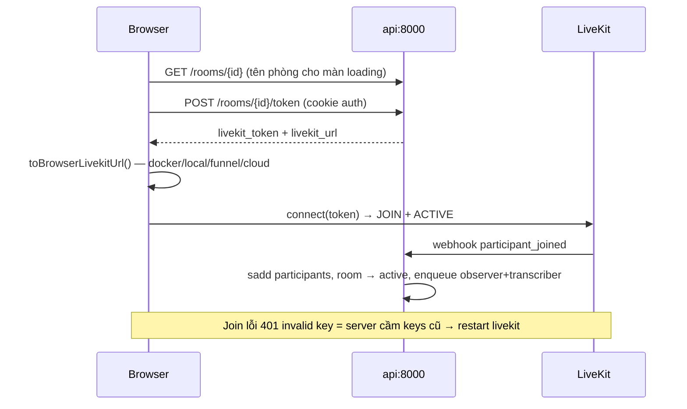
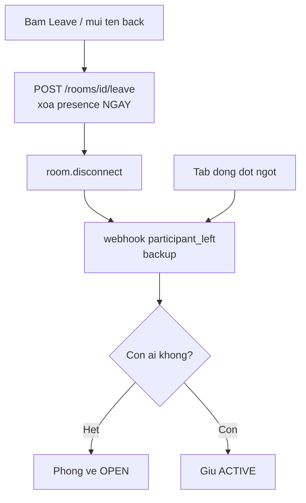
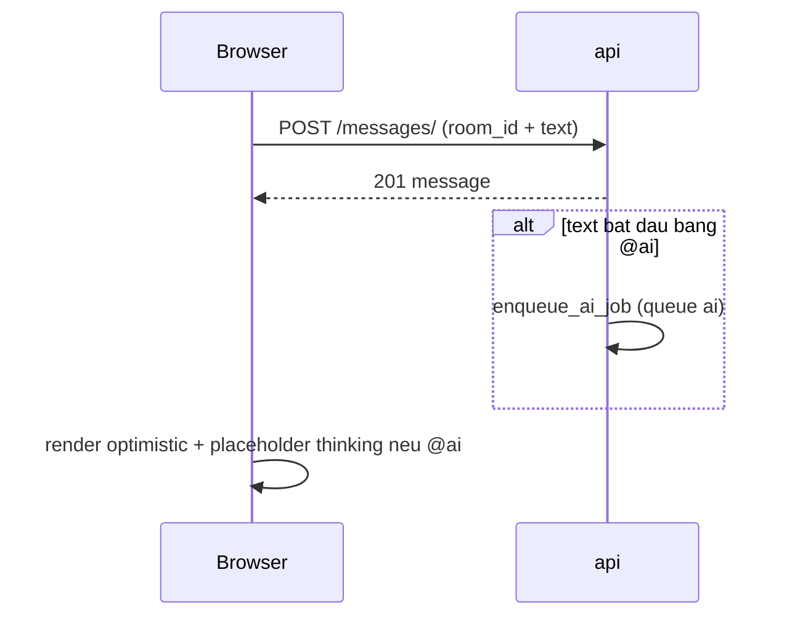
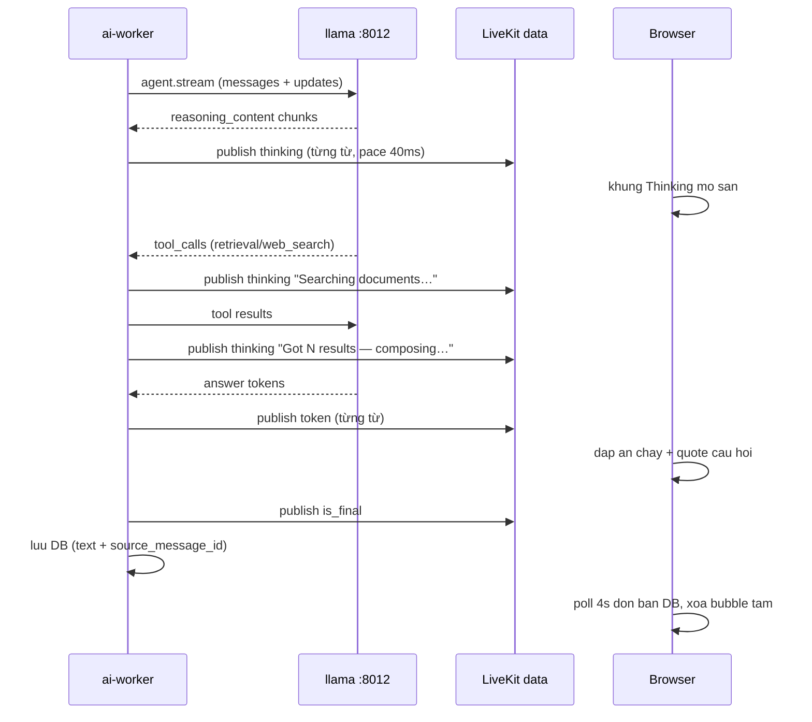
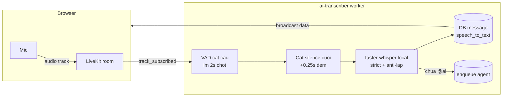
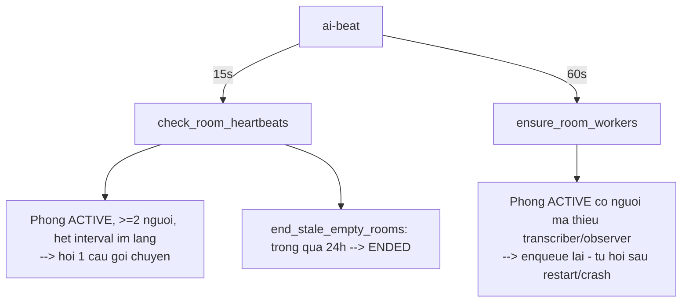
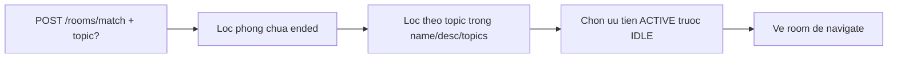
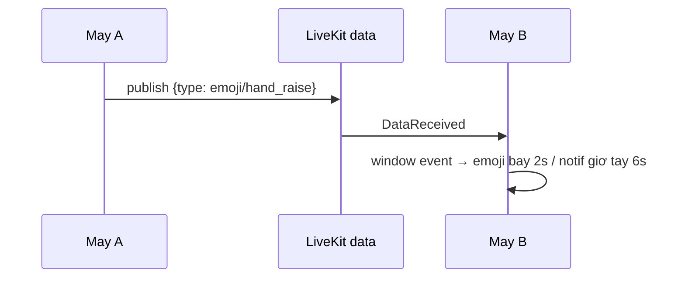
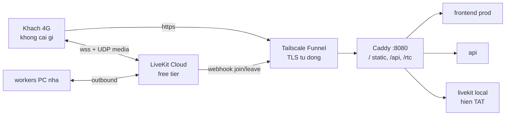
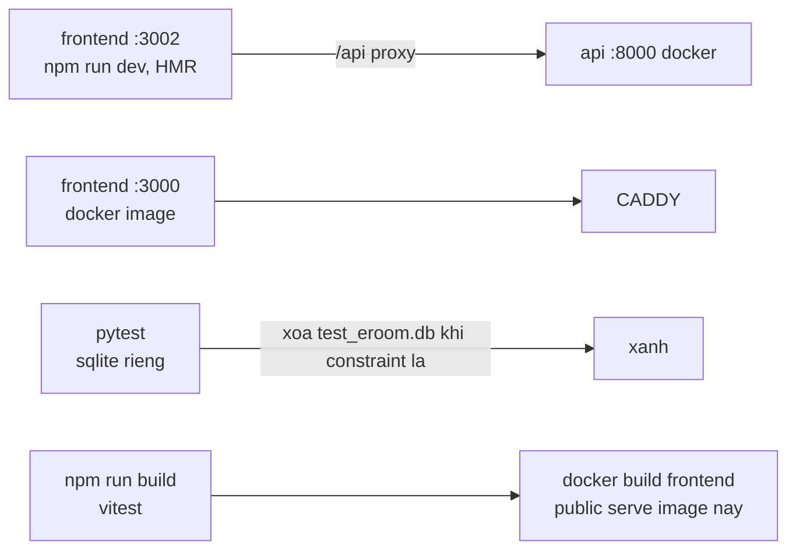

# E-Room — Workflows

> Version: v2.0.0 · Sơ đồ mermaid (GitHub render trực tiếp).

## 1. Vào phòng (join)

```mermaid
sequenceDiagram
    participant U as Browser
    participant A as api:8000
    participant L as LiveKit
    U->>A: GET /rooms/{id} (tên phòng cho màn loading)
    U->>A: POST /rooms/{id}/token (cookie auth)
    A-->>U: livekit_token + livekit_url
    U->>U: toBrowserLivekitUrl() — docker/local/funnel/cloud
    U->>L: connect(token) → JOIN + ACTIVE
    L->>A: webhook participant_joined
    A->>A: sadd participants, room → active, enqueue observer+transcriber
    Note over U,L: Join lỗi 401 invalid key = server cầm keys cũ → restart livekit
```

## 2. Rời phòng (leave) — 3 đường

```mermaid
flowchart TD
    A[Bam Leave / mui ten back] --> B[POST /rooms/id/leave<br/>xoa presence NGAY]
    B --> C[room.disconnect]
    C --> D[webhook participant_left<br/>backup]
    D --> E{Con ai khong?}
    E -->|Het| F[Phong ve OPEN]
    E -->|Con| G[Giu ACTIVE]
    H[Tab dong dot ngot] --> D
```

## 3. Gửi chat text

```mermaid
sequenceDiagram
    participant U as Browser
    participant A as api
    U->>A: POST /messages/ (room_id + text)
    A-->>U: 201 message
    alt text bat dau bang @ai
        A->>A: enqueue_ai_job (queue ai)
    end
    U->>U: render optimistic + placeholder thinking neu @ai
```

## 4. Pipeline `@ai` đầy đủ (thinking → tokens → final)

```mermaid
sequenceDiagram
    participant W as ai-worker
    participant LLM as llama :8012
    participant L as LiveKit data
    participant U as Browser
    W->>LLM: agent.stream (messages + updates)
    LLM-->>W: reasoning_content chunks
    W->>L: publish thinking (từng từ, pace 40ms)
    U->>U: khung Thinking mo san
    LLM-->>W: tool_calls (retrieval/web_search)
    W->>L: publish thinking "Searching documents…"
    W->>LLM: tool results
    W->>L: publish thinking "Got N results — composing…"
    LLM-->>W: answer tokens
    W->>L: publish token (từng từ)
    U->>U: dap an chay + quote cau hoi
    W->>L: publish is_final
    W->>W: luu DB (text + source_message_id)
    U->>U: poll 4s don ban DB, xoa bubble tam
```

## 5. Voice → transcript → `@ai` bằng miệng

```mermaid
flowchart LR
    subgraph B[Browser]
        MIC[Mic] -->|audio track| L1
    end
    subgraph B2[ai-transcriber worker]
        L1[LiveKit room] -->|track_subscribed| VAD[VAD cat cau<br/>im 2s chot]
        VAD --> TRIM[Cat silence cuoi<br/>+0.25s dem]
        TRIM --> STT[faster-whisper local<br/>strict + anti-lap]
        STT --> SAVE[(DB message<br/>speech_to_text)]
        STT -->|chua @ai| Q[(enqueue agent)]
    end
    SAVE -->|broadcast data| B
```

Điểm gãy từng gặp: `event.frame.data` là `memoryview` (không phải `bytes`) → normalize ở `normalize_pcm_int16`. Model whisper cache ở volume `whisper_data` để restart không tải lại.

## 6. Heartbeat + lifecycle + tự hồi worker

```mermaid
flowchart TD
    BEAT[ai-beat] -->|15s| HB[check_room_heartbeats]
    HB --> H1[Phong ACTIVE, >=2 nguoi, het interval im lang<br/>--> hoi 1 cau goi chuyen]
    HB --> H2[end_stale_empty_rooms: trong qua 24h --> ENDED]
    BEAT -->|60s| EW[ensure_room_workers]
    EW --> W1[Phong ACTIVE co nguoi ma thieu transcriber/observer<br/>--> enqueue lai - tu hoi sau restart/crash]
```

## 7. Quick match

```mermaid
flowchart LR
    U[POST /rooms/match + topic?] --> F[Loc phong chua ended]
    F --> T[Loc theo topic trong name/desc/topics]
    T --> S[Chon uu tien ACTIVE truoc IDLE]
    S --> R[Ve room de navigate]
```

## 8. Reactions & hand-raise (data channel, không qua server)

```mermaid
sequenceDiagram
    participant A as May A
    participant L as LiveKit data
    participant B as May B
    A->>L: publish {type: emoji/hand_raise}
    L->>B: DataReceived
    B->>B: window event → emoji bay 2s / notif giơ tay 6s
```

AI (`ai_*`) không bao giờ hiện trong các luồng trên (webhook + UI đều lọc).

## 9. Public hosting (đang chạy)

```mermaid
flowchart LR
    V[Khach 4G<br/>khong cai gi] -->|https| F[Tailscale Funnel<br/>TLS tu dong]
    F --> C[Caddy :8080<br/>/ static, /api, /rtc]
    C --> FE[frontend prod]
    C --> API[api]
    C --> LK[livekit local<br/>hien TAT]
    V <-->|wss + UDP media| LC[LiveKit Cloud<br/>free tier]
    W[workers PC nha] <-->|outbound| LC
    LC -->|webhook join/leave| F
```

Đường media trực tiếp PC↔4G đã chết (log: JOIN nhưng không bao giờ ACTIVE → client tự out sau ~15s) vì 2 đầu đều sau NAT + không mở được port router → chuyển Cloud.

## 10. Dev loop & test

```mermaid
flowchart LR
    DEV[frontend :3002<br/>npm run dev, HMR] -->|/api proxy| API[api :8000 docker]
    PROD[frontend :3000<br/>docker image] --> CADDY
    TEST[pytest<br/>sqlite rieng] -->|xoa test_eroom.db khi constraint la| OK[xanh]
    BUILD[npm run build<br/>vitest] --> IMG[docker build frontend<br/>public serve image nay]
```

Lưu ý: public serve **image**, không phải dev server — sửa frontend xong phải rebuild image + recreate container.
