# E-Room — Workflows

> Cập nhật: 09/2026 · Sơ đồ mermaid (GitHub render trực tiếp). Mọi endpoint đều có prefix `/api/v1`.

## 1. Vào phòng (join)

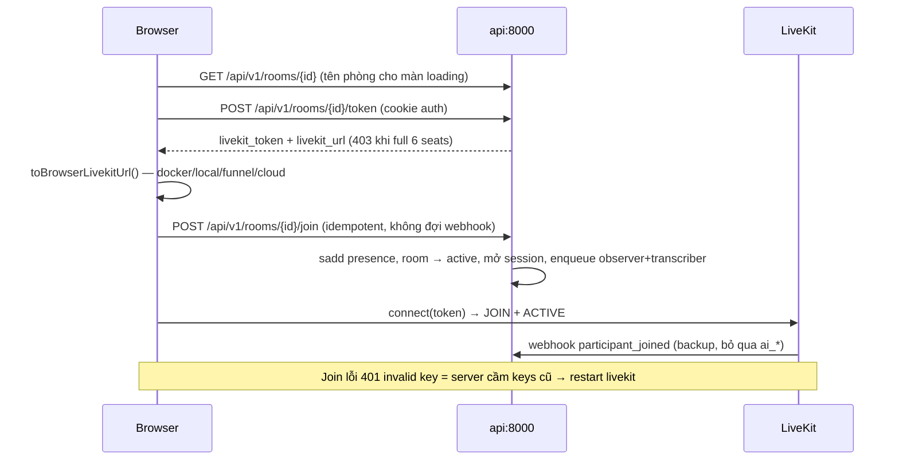
```mermaid
sequenceDiagram
    participant U as Browser
    participant A as api:8000
    participant L as LiveKit
    U->>A: GET /api/v1/rooms/{id} (tên phòng cho màn loading)
    U->>A: POST /api/v1/rooms/{id}/token (cookie auth)
    A-->>U: livekit_token + livekit_url (403 khi full 6 seats)
    U->>U: toBrowserLivekitUrl() — docker/local/funnel/cloud
    U->>A: POST /api/v1/rooms/{id}/join (idempotent, không đợi webhook)
    A->>A: sadd presence, room → active, mở session, enqueue observer+transcriber
    U->>L: connect(token) → JOIN + ACTIVE
    L->>A: webhook participant_joined (backup, bỏ qua ai_*)
    Note over U,L: Join lỗi 401 invalid key = server cầm keys cũ → restart livekit
```

## 2. Rời phòng (leave) — 3 đường

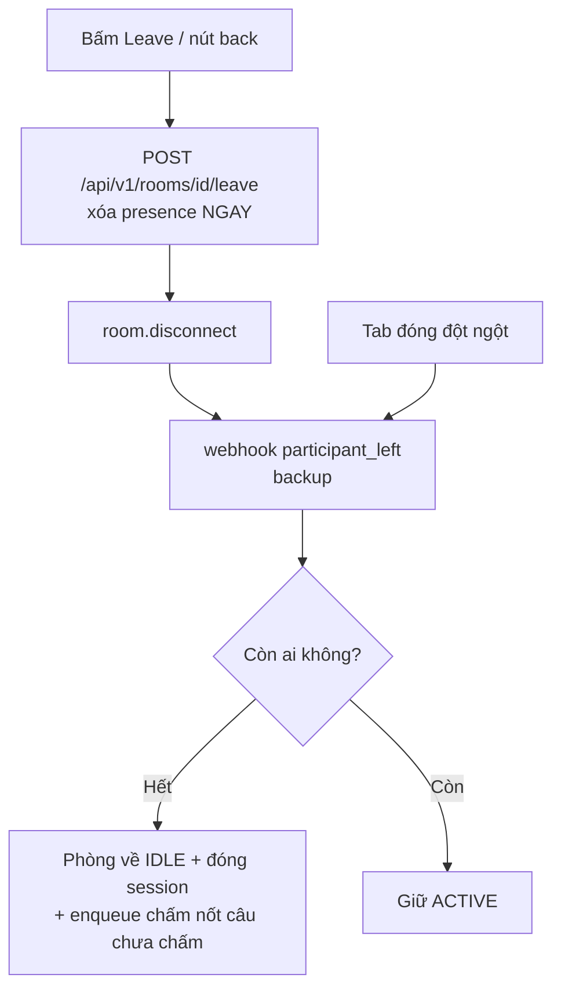
```mermaid
flowchart TD
    A[Bấm Leave / nút back] --> B[POST /api/v1/rooms/id/leave<br/>xóa presence NGAY]
    B --> C[room.disconnect]
    C --> D[webhook participant_left<br/>backup]
    D --> E{Còn ai không?}
    E -->|Hết| F[Phòng về IDLE + đóng session<br/>+ enqueue chấm nốt câu chưa chấm]
    E -->|Còn| G[Giữ ACTIVE]
    H[Tab đóng đột ngột] --> D
```

## 3. Gửi chat text

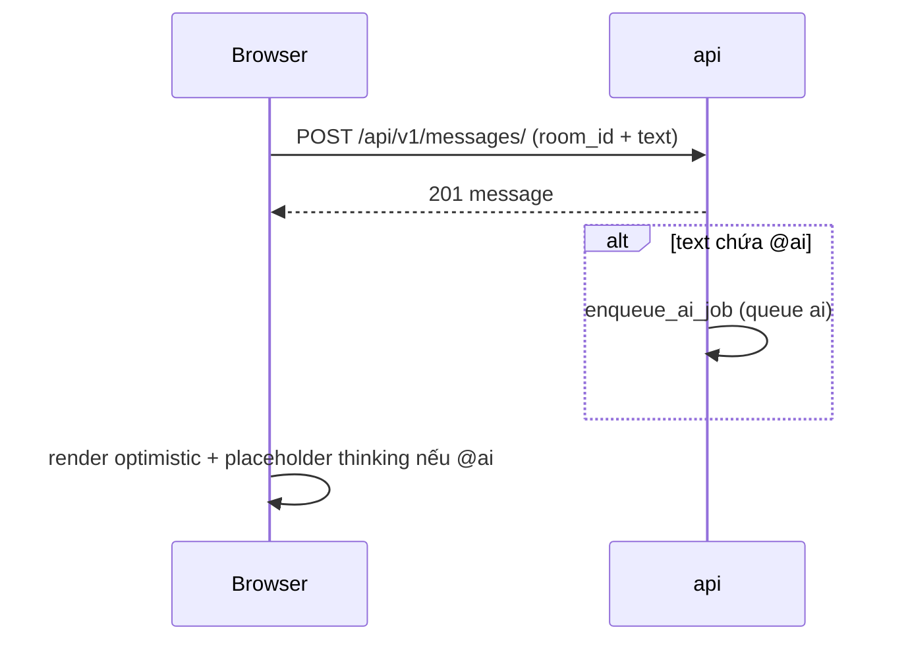
```mermaid
sequenceDiagram
    participant U as Browser
    participant A as api
    U->>A: POST /api/v1/messages/ (room_id + text)
    A-->>U: 201 message
    alt text chứa @ai
        A->>A: enqueue_ai_job (queue ai)
    end
    U->>U: render optimistic + placeholder thinking nếu @ai
```

## 4. Pipeline `@ai` đầy đủ (thinking → tokens → final)

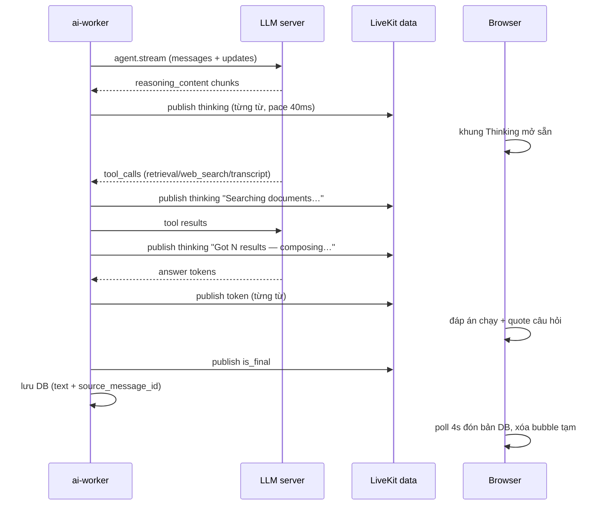
```mermaid
sequenceDiagram
    participant W as ai-worker
    participant LLM as LLM server
    participant L as LiveKit data
    participant U as Browser
    W->>LLM: agent.stream (messages + updates)
    LLM-->>W: reasoning_content chunks
    W->>L: publish thinking (từng từ, pace 40ms)
    U->>U: khung Thinking mở sẵn
    LLM-->>W: tool_calls (retrieval/web_search/transcript)
    W->>L: publish thinking "Searching documents…"
    W->>LLM: tool results
    W->>L: publish thinking "Got N results — composing…"
    LLM-->>W: answer tokens
    W->>L: publish token (từng từ)
    U->>U: đáp án chạy + quote câu hỏi
    W->>L: publish is_final
    W->>W: lưu DB (text + source_message_id)
    U->>U: poll 4s đón bản DB, xóa bubble tạm
```

## 5. Voice → transcript → `@ai` bằng miệng

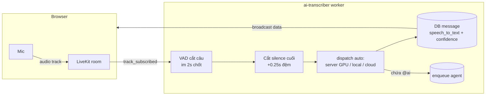
```mermaid
flowchart LR
    subgraph B[Browser]
        MIC[Mic] -->|audio track| L1
    end
    subgraph B2[ai-transcriber worker]
        L1[LiveKit room] -->|track_subscribed| VAD[VAD cắt câu<br/>im 2s chốt]
        VAD --> TRIM[Cắt silence cuối<br/>+0.25s đệm]
        TRIM --> STT[dispatch auto:<br/>server GPU / local / cloud]
        STT --> SAVE[(DB message<br/>speech_to_text + confidence)]
        STT -->|chứa @ai| Q[(enqueue agent)]
    end
    SAVE -->|broadcast data| B
```

Điểm gãy từng gặp: `event.frame.data` là `memoryview` (không phải `bytes`) → normalize ở `normalize_pcm_int16`. Model whisper cache ở volume để restart không tải lại.

## 6. Heartbeat + lifecycle + tự hồi worker

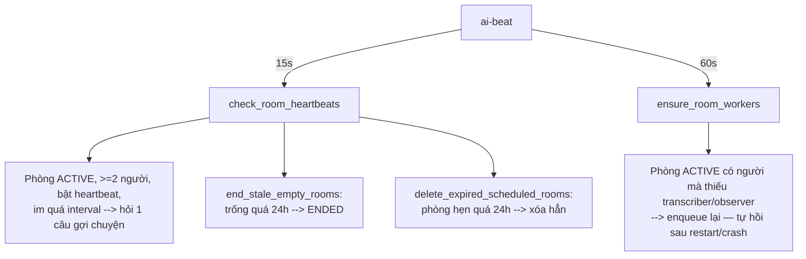
```mermaid
flowchart TD
    BEAT[ai-beat] -->|15s| HB[check_room_heartbeats]
    HB --> H1[Phòng ACTIVE, >=2 người, bật heartbeat,<br/>im quá interval --> hỏi 1 câu gợi chuyện]
    HB --> H2[end_stale_empty_rooms:<br/>trống quá 24h --> ENDED]
    HB --> H3[delete_expired_scheduled_rooms:<br/>phòng hẹn quá 24h --> xóa hẳn]
    BEAT -->|60s| EW[ensure_room_workers]
    EW --> W1[Phòng ACTIVE có người mà thiếu transcriber/observer<br/>--> enqueue lại — tự hồi sau restart/crash]
```

## 7. Chấm điểm phát âm (score → feedback)

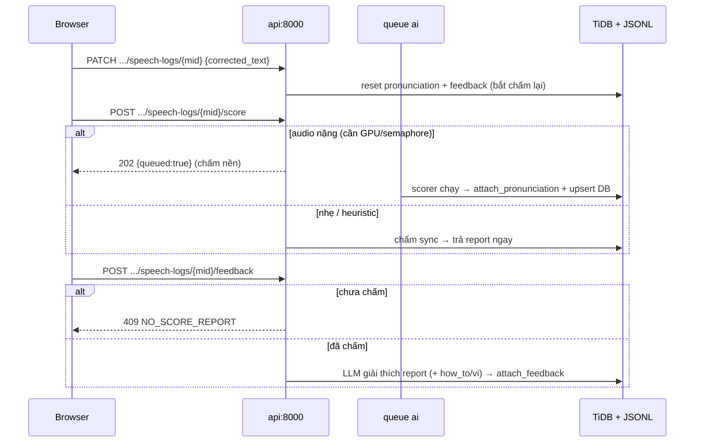
```mermaid
sequenceDiagram
    participant U as Browser
    participant A as api:8000
    participant Q as queue ai
    participant DB as TiDB + JSONL
    U->>A: PATCH .../speech-logs/{mid} {corrected_text}
    A->>DB: reset pronunciation + feedback (bắt chấm lại)
    U->>A: POST .../speech-logs/{mid}/score
    alt audio nặng (cần GPU/semaphore)
        A-->>U: 202 {queued:true} (chấm nền)
        Q->>DB: scorer chạy → attach_pronunciation + upsert DB
    else nhẹ / heuristic
        A->>DB: chấm sync → trả report ngay
    end
    U->>A: POST .../speech-logs/{mid}/feedback
    alt chưa chấm
        A-->>U: 409 NO_SCORE_REPORT
    else đã chấm
        A->>DB: LLM giải thích report (+ how_to/vi) → attach_feedback
    end
```

Không audio → `no_audio`; scorer crash → `scorer_failed` (giữ điểm cũ, không ghi đè). Chi tiết: `reading-score.md`.

## 8. Session: feedback + hỏi đáp transcript

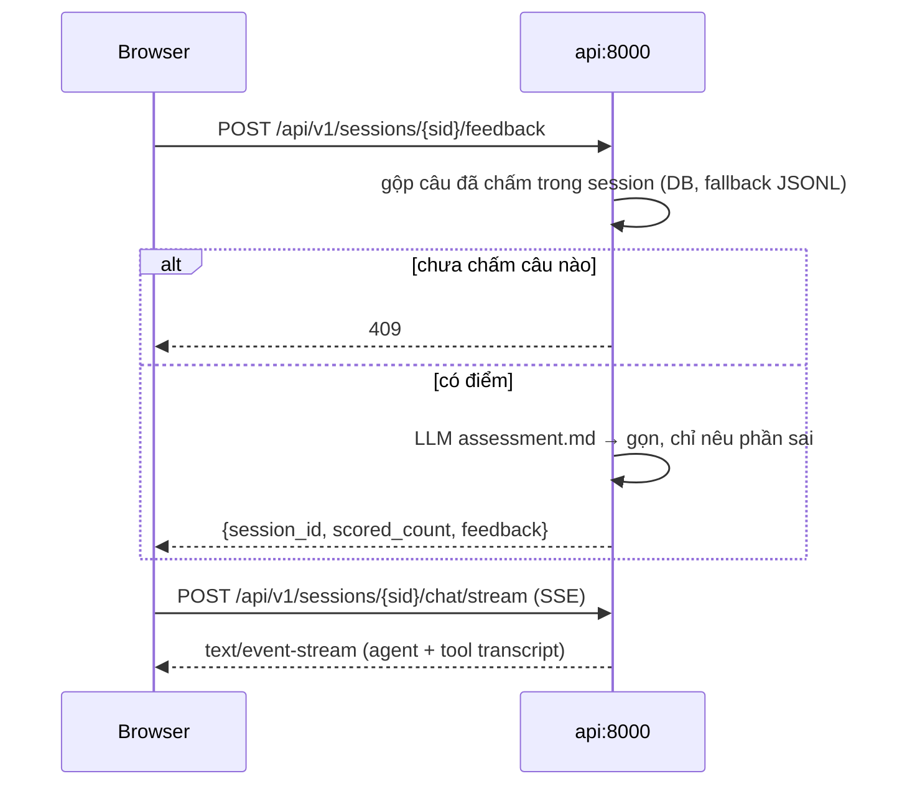
```mermaid
sequenceDiagram
    participant U as Browser
    participant A as api:8000
    U->>A: POST /api/v1/sessions/{sid}/feedback
    A->>A: gộp câu đã chấm trong session (DB, fallback JSONL)
    alt chưa chấm câu nào
        A-->>U: 409
    else có điểm
        A->>A: LLM assessment.md → gọn, chỉ nêu phần sai
        A-->>U: {session_id, scored_count, feedback}
    end
    U->>A: POST /api/v1/sessions/{sid}/chat/stream (SSE)
    A-->>U: text/event-stream (agent + tool transcript)
```

## 9. Upload tài liệu RAG

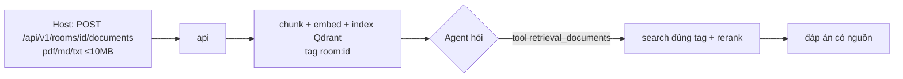
```mermaid
flowchart LR
    U[Host: POST /api/v1/rooms/id/documents<br/>pdf/md/txt ≤10MB] --> A[api]
    A --> C[chunk + embed + index Qdrant<br/>tag room:id]
    C --> Q{Agent hỏi}
    Q -->|tool retrieval_documents| R[search đúng tag + rerank]
    R --> ANS[đáp án có nguồn]
```

## 10. TTS đọc mẫu

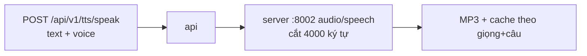
```mermaid
flowchart LR
    U[POST /api/v1/tts/speak<br/>text + voice] --> A[api]
    A --> K[server :8002 audio/speech<br/>cắt 4000 ký tự]
    K --> M[MP3 + cache theo giọng+câu]
```

`GET /api/v1/tts/voices` trả 4 giọng cố định.

## 11. Quick match + Schedule + Private

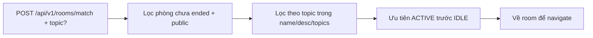
```mermaid
flowchart LR
    U[POST /api/v1/rooms/match + topic?] --> F[Lọc phòng chưa ended + public]
    F --> T[Lọc theo topic trong name/desc/topics]
    T --> S[Ưu tiên ACTIVE trước IDLE]
    S --> R[Về room để navigate]
```

- **Schedule**: modal đặt lịch (Profile → Schedule) tạo room kèm `scheduled_at`; quá 24h task dọn xóa hẳn. Thêm email → tự bật private.
- **Private**: `is_private` + `allowed_emails`; list/match ẩn với người lạ; mọi đọc/ghi phòng qua `ensure_room_access` (chỉ host/admin/email được mời).

## 12. Reactions & hand-raise (data channel, không qua server)

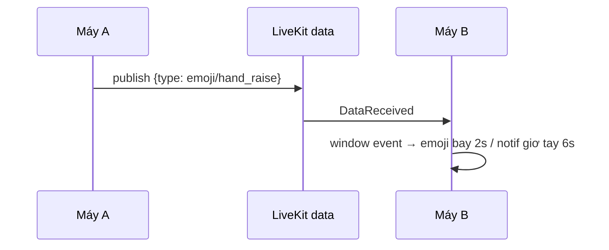
```mermaid
sequenceDiagram
    participant A as Máy A
    participant L as LiveKit data
    participant B as Máy B
    A->>L: publish {type: emoji/hand_raise}
    L->>B: DataReceived
    B->>B: window event → emoji bay 2s / notif giơ tay 6s
```

AI (`ai_*`) không bao giờ hiện trong các luồng trên (webhook + presence + UI đều lọc prefix `ai_`).

## 13. Public hosting (đang chạy)

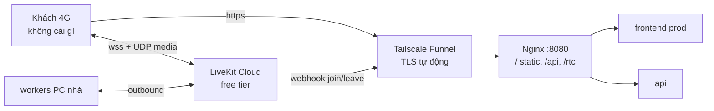
```mermaid
flowchart LR
    V[Khách 4G<br/>không cài gì] -->|https| F[Tailscale Funnel<br/>TLS tự động]
    F --> C[Nginx :8080<br/>/ static, /api, /rtc]
    C --> FE[frontend prod]
    C --> API[api]
    V <-->|wss + UDP media| LC[LiveKit Cloud<br/>free tier]
    W[workers PC nhà] <-->|outbound| LC
    LC -->|webhook join/leave| F
```

Đường media trực tiếp PC↔4G đã chết (log: JOIN nhưng không bao giờ ACTIVE → client tự out sau ~15s) vì 2 đầu đều sau NAT + không mở được port router → chuyển Cloud. Livekit self-host giữ để dev LAN (`dev.bat`).

## 14. Dev loop & test

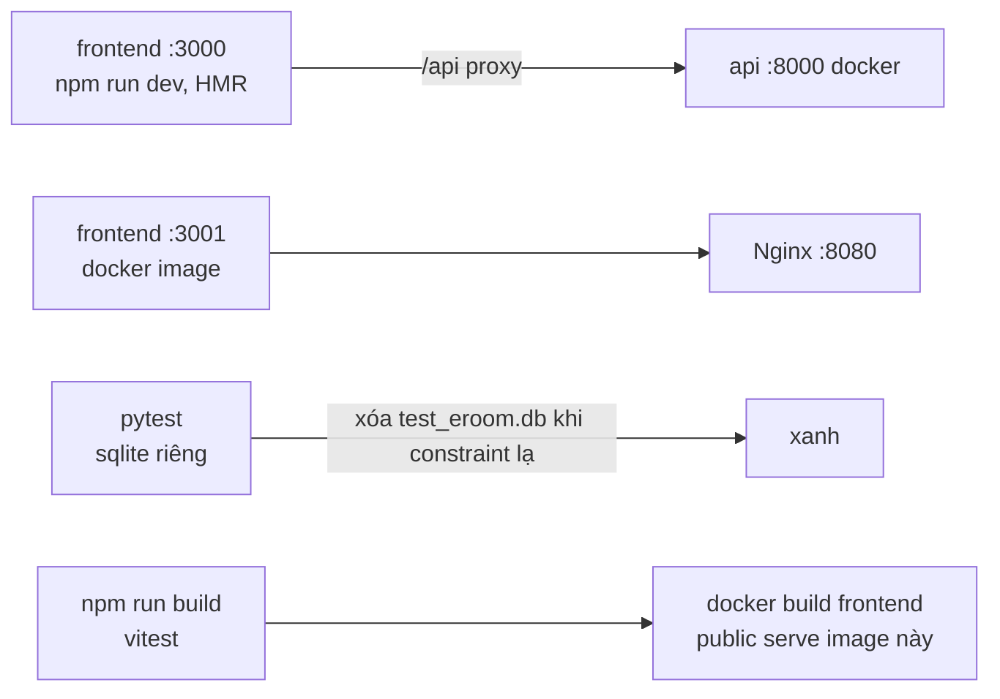
```mermaid
flowchart LR
    DEV[frontend :3000<br/>npm run dev, HMR] -->|/api proxy| API[api :8000 docker]
    PROD[frontend :3001<br/>docker image] --> NG[Nginx :8080]
    TEST[pytest<br/>sqlite riêng] -->|xóa test_eroom.db khi constraint lạ| OK[xanh]
    BUILD[npm run build<br/>vitest] --> IMG[docker build frontend<br/>public serve image này]
```

Lưu ý: public serve **image**, không phải dev server — sửa frontend xong phải rebuild image + recreate container.
